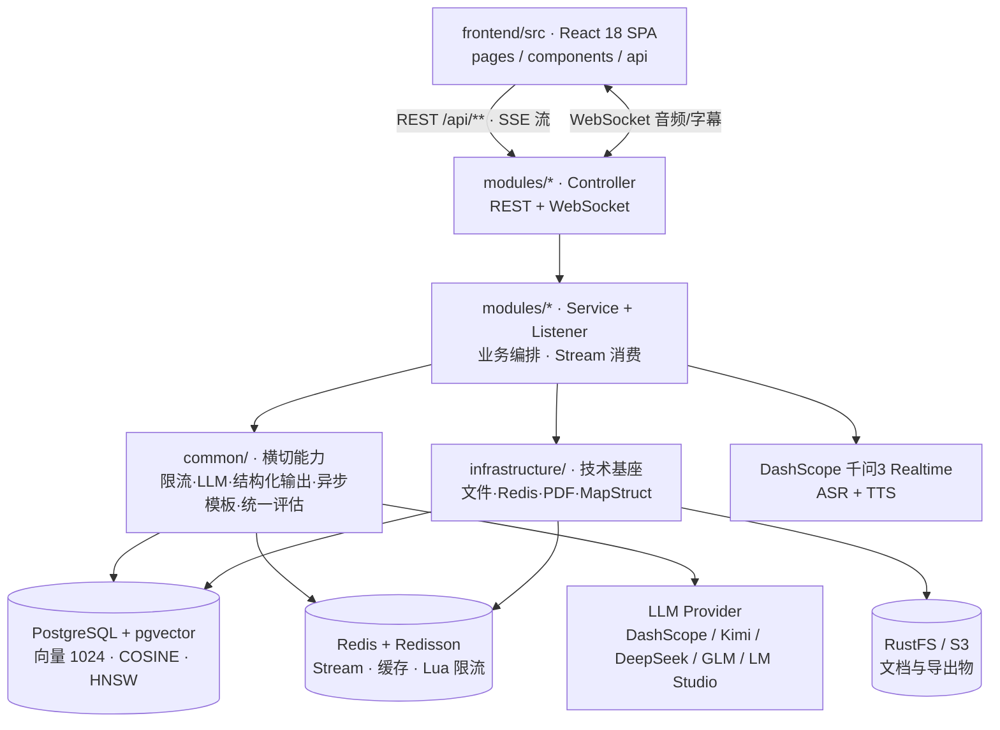
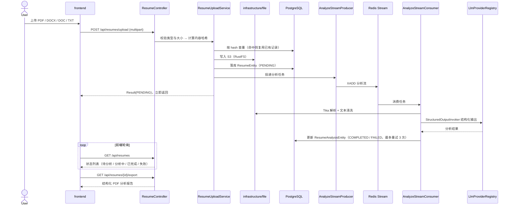
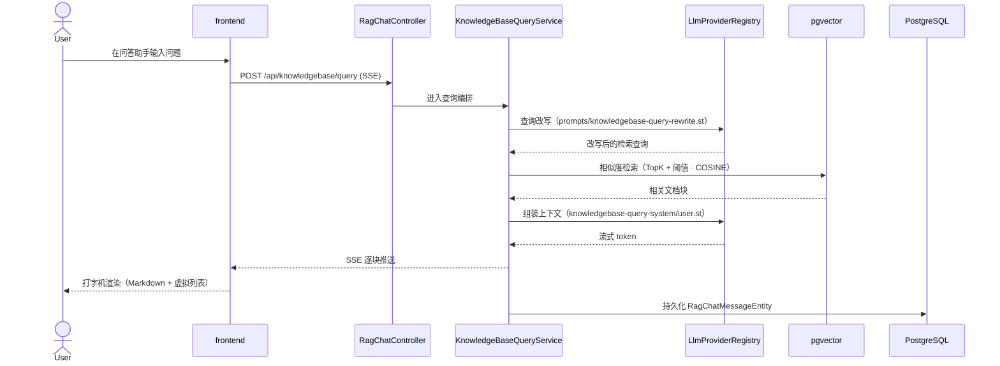

# InterviewGuide 智能 AI 面试官平台 — Architecture Blueprint

> 生成时间：2026-09-13 · 基于当前 master 分支（HEAD `b2d1ca0`）
> 项目规模：约 4.3 万行主源码（后端 `app/src/main/java` 25,235 行 + 前端 `frontend/src` 17,990 行；含后端测试 7,307 行约 5.05 万行）· 9 个核心模块

## 1. 项目一句话定位

> InterviewGuide 是一个自托管的智能面试辅助平台：求职者上传简历后获得 AI 分析报告，可进行文字或实时语音模拟面试（Skill 驱动出题 + 统一评估 + PDF 报告），并将自己的资料沉淀为知识库，通过 RAG 问答与知识库题库面试持续练习；同时提供面试日程管理（邀请解析 + 日历）与多 LLM Provider 可视化配置。

主要使用者：求职者（练面试）、HR 与培训机构（批量评估与题库运营）。

## 2. 技术栈清单

### 2.1 语言与运行时

- **后端语言**：Java 25（启用虚拟线程 `spring.threads.virtual.enabled`，面向 I/O 密集的 AI 调用与 SSE 长连接）
- **后端构建**：Gradle 9.6.1（Gradle Wrapper），单模块 `app`
- **前端语言**：TypeScript 5.6
- **前端运行时**：Node.js 18+（CI 使用 24），包管理器 pnpm 10.26

### 2.2 框架与关键库

| 类别 | 名称 | 用途 |
|---|---|---|
| Web 框架 | Spring Boot 4.1.0（`spring-boot-starter-webmvc`） | REST API |
| 实时通信 | `spring-boot-starter-websocket` | 语音面试双向音频/字幕 |
| AI 集成 | Spring AI 2.0.0（`spring-ai-starter-model-openai`） | OpenAI 兼容 Chat / Embedding |
| AI 扩展 | Spring AI Agent Utils 0.10.0 | Skill 资源加载（`classpath:skills`）、Advisor 扩展 |
| 语音模型 | DashScope SDK 2.22.7 | 千问3 ASR / TTS（实时语音） |
| 数据库 | PostgreSQL 14+（Compose 默认 pg16） | 主存储 |
| 向量检索 | pgvector（`spring-ai-starter-vector-store-pgvector`） | 1024 维 · COSINE · HNSW 索引 |
| Schema 管理 | Flyway（`baseline-on-migrate`，`ddl-auto: validate`） | 迁移在 `resources/db/migration` |
| ORM | Spring Data JPA / Hibernate | Repository 层 |
| 缓存与队列 | Redis 6+ / Redisson 4.0.0 | Stream 异步、会话缓存、Lua 限流 |
| 对象存储 | AWS S3 SDK 2.29.51 | S3 兼容（本地 RustFS / 部署 MinIO） |
| 文档解析 | Apache Tika 2.9.2 | PDF / DOCX / DOC / TXT / MD |
| 报表导出 | iText 8.0.5 | PDF 报告（中文字体在 `resources/fonts/`） |
| 对象映射 | MapStruct 1.6.3 | Entity → DTO/Response |
| API 文档 | SpringDoc OpenAPI 3.0.2 | `/swagger-ui.html`，仅扫描 `interview.guide.modules` |
| 可观测 | Spring Boot Actuator + Micrometer | TTS/ASR 延迟、会话时长埋点 |
| 前端 UI | React 18.3 / Vite 5.4 / Tailwind CSS 4 | SPA |
| 前端路由 | react-router-dom 7.11 | **完整路由表定义在 `App.tsx`**；`src/constants/routes.ts` 只放被多处复用的路径常量（5 条）与路由 pattern |
| 前端图表 | Recharts 3.6 / react-big-calendar 1.19 | 能力雷达图、面试日历 |
| 前端长列表 | react-virtuoso 4.18 | RAG 聊天虚拟滚动 |
| 前端本地推理 | onnxruntime-web 1.24 | 浏览器侧模型推理 |

### 2.3 关键依赖（项目离不开的）

1. `spring-ai-starter-model-openai` — 所有文本 LLM（出题、评估、解析）的唯一接入通道，由 `common/ai/LlmProviderRegistry` 统一分发。
2. `spring-ai-starter-vector-store-pgvector` — RAG 检索的向量读写。
3. `spring-boot-starter-websocket` + `dashscope-sdk-java` — 实时语音面试的音频链路。
4. Redisson — 提供 Redis Stream 模板的底层客户端与分布式能力。
5. Apache Tika — 简历与知识库文档的统一解析入口。
6. iText 8 — 简历分析报告与面试评估报告的 PDF 生成。
7. react-virtuoso / react-big-calendar — 两个体量最大页面的性能与交互基座。

## 3. 顶层架构图

> 后端按「横切能力层（common / infrastructure）+ 自包含业务模块（modules）」组织；前端按「api / components / hooks / pages / types」组织。



**分层约束**（来自 `AGENTS.md`，代码中普遍遵守）：

- Controller 只做路由、校验与委托；业务编排在 Service；`@Transactional` 只在 Service 层且范围最小。
- 基础设施能力必须落在 `common/` 或 `infrastructure/`，不散落到业务 Service。
- 对外统一返回 `Result<T>`，禁止直接返回 Entity。
- LLM / S3 / 外部 HTTP 调用不得放在数据库事务内。

## 4. 数据流（典型请求路径）

### 4.1 简历上传 → Redis Stream 异步分析 → PDF 报告



### 4.2 RAG 问答（查询改写 → 向量检索 → SSE 流式回答）



## 5. 模块索引

| 模块 | 一句话职责 | 规模 | 详细档案 |
|---|---|---|---|
| `common` | 全项目共用的横切能力：限流、LLM 接入、结构化输出、Prompt 安全、统一异常与响应、Redis Stream 异步模板、统一面试评估、事务与配置 | ~3.1K 行 / 34 文件 | [modules/common.md](./modules/common.md) |
| `infrastructure` | 技术基座：S3 对象存储、Tika 文档解析、文本清洗、文件哈希/校验、Redis 缓存与 Stream、iText PDF 导出、MapStruct 映射 | ~2.6K 行 / 14 文件 | [modules/infrastructure.md](./modules/infrastructure.md) |
| `resume` | 简历模块：多格式解析、哈希去重、Redis Stream 异步 AI 分析与进度、失败重试、分析报告 PDF 导出 | ~1.8K 行 / 16 文件 | [modules/resume.md](./modules/resume.md) |
| `interview` | 文字面试：Skill 驱动出题、JD 解析、历史题去重、多轮追问、阶段时长联动、异步评估与报告导出 | ~4.0K 行 / 27 文件 | [modules/interview.md](./modules/interview.md) |
| `voiceinterview` | 实时语音面试：WebSocket + 千问3 ASR/TTS/LLM，服务端 VAD、实时字幕、句子级并发 TTS、上下文压缩、暂停/恢复 | ~5.4K 行 / 28 文件 | [modules/voiceinterview.md](./modules/voiceinterview.md) |
| `knowledgebase` | 知识库：文档上传解析与异步向量化、RAG 问答（SSE + 查询改写）、题库异步生成与管理、知识库专项面试编排 | ~5.5K 行 / 49 文件 | [modules/knowledgebase.md](./modules/knowledgebase.md) |
| `interviewschedule` | 面试日程：规则 + AI 双引擎解析邀请文本（飞书/腾讯会议/Zoom）、日历视图、状态流转与自动过期 | ~0.9K 行 / 11 文件 | [modules/interviewschedule.md](./modules/interviewschedule.md) |
| `llmprovider` | 多模型配置与持久化：Provider 增删改查、API Key 加密落盘、默认聊天/向量模型切换、ASR/TTS 配置与连通性测试 | ~1.9K 行 / 17 文件 | [modules/llmprovider.md](./modules/llmprovider.md) |
| `frontend` | 前端 SPA：简历库、模拟（文本/语音）面试、知识库管理与题库面试、RAG 问答助手、面试日程、多模型设置 | ~18.0K 行 / 85 文件 | [modules/frontend.md](./modules/frontend.md) |

**主干 HTTP 路由**（各模块档案有完整清单）：

| 前缀 | 模块 | 代表端点 |
|---|---|---|
| `/api/resumes/**` | resume | `POST /api/resumes/upload`、`GET /api/resumes/{id}/export` |
| `/api/interview/**` | interview | `POST /api/interview/sessions`、`POST .../answers`、`GET .../report` |
| `/api/interview/skills/**` | interview | `GET /api/interview/skills`（Skill 方向与题目参考） |
| `/api/knowledgebase/**`、`/api/rag-chat/**` | knowledgebase | `POST /api/knowledgebase/query`（SSE）、`POST /api/knowledgebase/{id}/questions/generate` |
| `/api/knowledgebase-interviews/**` | knowledgebase | `POST /api/knowledgebase-interviews/sessions` |
| `/api/voice-interview/**` | voiceinterview | `POST /api/voice-interview/sessions` |
| `/ws/voice-interview/{sessionId}` | voiceinterview | WebSocket 实时语音（音频 + 字幕双向）。**注意：WS 端点独立于 `/api` 前缀，挂在 `/ws/` 下**（`config/WebSocketConfig`） |
| `/api/interview-schedule/**` | interviewschedule | `POST /api/interview-schedule/parse` |
| `/api/llm-provider/**` | llmprovider | `PUT /api/llm-provider/default-provider`、`POST /api/llm-provider/{id}/test` |

## 6. 关键设计决策

1. **PostgreSQL + pgvector 单库承载关系数据与向量，而非引入独立向量数据库** → 关系数据与向量需在同一事务语义下演进，且单个 PG 实例即可满足当前检索量级，精简部署组件数量。替代方案是 Milvus / Qdrant / Elasticsearch（检索能力更强，但多一个需要运维的组件）。向量维度 1024、距离 COSINE、索引 HNSW 均可配置。

2. **用 Redis Stream 而非 Kafka 承担异步任务** → 简历分析、文档向量化、题库生成、面试评估都是"低吞吐、需解耦、要能换实现语言"的任务，Redis 已在架构中（缓存 + 限流 + 会话），复用它不增加新组件；`AbstractStreamProducer` / `AbstractStreamConsumer` 两个模板统一了生产消费与 ACK 语义。替代方案是 Kafka / RabbitMQ（吞吐与生态更强，但引入额外运维成本）。代码中已体现"消费前先校验实体存在，实体已删除则 ACK 丢弃"的约定。

3. **LLM 接入统一收敛到 `LlmProviderRegistry` + `StructuredOutputInvoker`** → 多 Provider（DashScope / Kimi / DeepSeek / GLM / LM Studio）都是 OpenAI 兼容端点，运行时可在设置页切换默认聊天/向量模型而无需改代码；业务代码只声明"要什么结构"，重试与降级逻辑集中在 `StructuredOutputInvoker`，避免在业务 Service 里复制粘贴。替代方案是各模块直连 SDK（实现简单，但切换模型需要改代码、重试逻辑重复）。

4. **文字面试与语音面试共用一套评估引擎（`common/evaluation/UnifiedEvaluationService`）** → 两种交互形态的评估口径必须可比（同一份报告结构、同一套评分维度），因此把"分批评估 + 结构化输出 + 二次汇总 + 降级兜底"抽到 common。替代方案是各写一套（可以针对形态特化，但结果不可比、维护双份）。

5. **出题策略外置为 `resources/skills/<方向>/SKILL.md`，而非硬编码在 Java 里** → 内置 10+ 面试方向（Java 后端、阿里/字节/腾讯专项、前端、Python、算法、系统设计、测开、AI Agent 等），每个方向用自己的 Markdown 描述考察范围、难度分布与参考题库，由 Spring AI Agent Utils 在运行期加载。新增方向只需加目录，无需改 Java 代码。

6. **运行时 Provider 配置落在用户目录而非 classpath** → 默认写到 `~/.interview-guide/llm-providers.yml` / `.env`，避免污染源码目录或 jar 内资源；API Key 经 `ApiKeyEncryptionService` 加密后落盘，加密密钥来自环境变量 `APP_AI_CONFIG_ENCRYPTION_KEY`。替代方案是写回 `application.yml`（部署简单，但容器内不可写且易误提交密钥）。

> 以上推断基于代码事实（manifest、import、配置、README）。如有偏差请指正。

## 7. 部署 / 运行 / 测试

### 7.1 怎么跑起来

环境要求：JDK 25、Node.js 18+、pnpm 10+、Docker（推荐，用于起依赖服务）。

```bash
# 1. 准备环境变量（后端 bootRun 会自动读取根目录 .env）
cp .env.example .env
#   至少填两项：
#   AI_BAILIAN_API_KEY              —— DashScope 文本模型 + ASR + TTS
#   APP_AI_CONFIG_ENCRYPTION_KEY    —— Provider API Key 加密密钥，部署后须保持不变

# 2. 启动依赖服务（PostgreSQL+pgvector / Redis / RustFS）
docker compose -f docker-compose.dev.yml up -d

# 3. 首次启动后访问 http://localhost:9001（RustFS 控制台），用 RUSTFS_ACCESS_KEY / RUSTFS_SECRET_KEY
#    登录（docker-compose.dev.yml 默认 rustfsadmin / rustfsadmin），手动创建名为 interview-guide 的 bucket

# 4. 启动后端（默认端口 8080，Flyway 自动执行迁移）
./gradlew :app:bootRun

# 5. 启动前端（vite 已配置 /api 代理到 8080）
cd frontend && pnpm install && pnpm run dev
```

其他常用命令：

```bash
./gradlew :app:compileJava          # 只编译
./gradlew :app:bootRun              # 运行
```

接口文档：`http://localhost:8080/swagger-ui.html`。

### 7.2 怎么部署

- **一键部署**：根目录 `docker-compose.yml` 定义完整栈（前端 + 后端 + PostgreSQL + Redis + MinIO）。
- **后端镜像**：`app/Dockerfile`；`.dockerignore` 已配置。
- **数据持久化（开发编排）**：`${HOME}/documents/interview_guide/{pgvector,redis,rustFS}`。
- **关键环境变量**：

| 变量 | 含义 |
|---|---|
| `AI_BAILIAN_API_KEY` | DashScope 文本模型、ASR、TTS 的统一密钥（必需） |
| `APP_AI_CONFIG_ENCRYPTION_KEY` | Provider API Key 加密密钥（必需，部署后不可变更） |
| `AI_MODEL` | 默认聊天模型（默认 `qwen3.5-flash`） |
| `POSTGRES_HOST/PORT/DB/USER/PASSWORD` | 数据库连接 |
| `REDIS_HOST/REDIS_PORT` | Redis 连接 |
| `APP_STORAGE_ENDPOINT/ACCESS_KEY/SECRET_KEY/BUCKET` | S3 兼容存储 |
| `APP_AI_CONFIG_YAML_PATH` / `APP_AI_CONFIG_ENV_PATH` | 运行期 Provider 配置落点（默认 `~/.interview-guide/`） |
| `APP_VOICE_USER_UTTERANCE_DEBOUNCE_MS` / `APP_VOICE_ASR_SILENCE_MS` | 语音面试 ASR 断句行为 |

### 7.3 怎么跑测试

```bash
# 后端单元 / 集成测试（JUnit 5 + Mockito + AssertJ；集成测试用 H2，限流测试需真实 Redis）
./gradlew :app:test --no-daemon

# 前端构建（tsc 类型检查 + vite build）——改前端至少跑这个
cd frontend && pnpm run build

# 前端纯逻辑单测（node --test，无需额外框架）
cd frontend && pnpm run test:interview-history \
  && pnpm run test:question-generation \
  && pnpm run test:interview-capacity \
  && pnpm run test:interview-entry

# 端到端测试（Playwright）
cd frontend && pnpm run test:e2e
```

### 7.4 CI/CD

- 平台：GitHub Actions，工作流 `.github/workflows/ci.yml`。
- 两个并行 Job：
  1. **Backend tests** — 签出 → 装 Java 25 → `./gradlew :app:test --no-daemon`
  2. **Frontend tests and build** — 签出 → 装 pnpm → 装 Node 24（缓存 `frontend/pnpm-lock.yaml`）→ `pnpm install --frozen-lockfile` → 跑 4 个 `node --test` 单测 → `pnpm run build`

---

> **下一步**：看 [LEARNING_PATH.md](./LEARNING_PATH.md) 选一条路径开始读代码。
