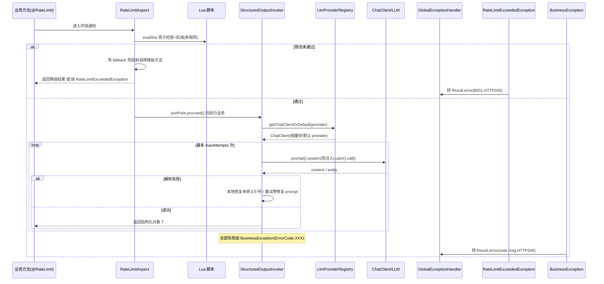

# 模块：common（Dossier）

> 路径：`app/src/main/java/interview/guide/common`
> 规模：约 3087 行 · 34 个文件 · 主要语言：Java

## 1. 定位
全项目共用的横切能力层：提供限流、LLM 接入、结构化输出、Prompt 安全防护、统一异常与响应封装、Redis Stream 异步模板、统一面试评估、事务/配置工具，被各业务模块（resume、interview、knowledgebase、provider 等）复用。

## 2. 关键文件清单

| 子包 | 文件路径 | 一句话作用 |
| --- | --- | --- |
| ai | `ai/LlmProviderRegistry.java` | LLM Provider 注册表，缓存并动态创建 ChatClient/EmbeddingModel |
| ai | `ai/StructuredOutputInvoker.java` | 统一封装结构化输出调用与重试/修复/降级 |
| ai | `ai/PromptSanitizer.java` | Prompt 注入净化与不可预测分隔符包裹 |
| ai | `ai/ApiPathResolver.java` | 构建 OpenAIClient 并自动补齐 `/v1` 版本号 |
| ai | `ai/PromptSecurityConstants.java` | 防注入指令常量（`ANTI_INJECTION_INSTRUCTION` / `DATA_BOUNDARY_INSTRUCTION`） |
| ai | `ai/AgentUtilsConfiguration.java` | 装配 SkillsTool（Bean `interviewSkillsToolCallback`） |
| ai | `ai/AgentUtilsProperties.java` | `app.ai.agent-utils` 配置（skillsRoot） |
| ai | `ai/LlmProviderProperties.java` | `app.ai` 配置（默认 provider、advisors、security） |
| ai | `ai/StructuredOutputProperties.java` | `app.ai` 结构化输出重试/度量配置 |
| aspect | `aspect/RateLimitAspect.java` | `@RateLimit` 环绕切面，调用 Lua 原子限流 |
| async | `async/AbstractStreamProducer.java` | Redis Stream 生产者模板基类 |
| async | `async/AbstractStreamConsumer.java` | Redis Stream 消费者模板基类（含重试/ACK） |
| config | `config/JacksonConfig.java` | Jackson 序列化配置 |
| config | `config/CorsConfig.java` + `CorsProperties.java` | 跨域配置与属性 |
| config | `config/S3Config.java` | S3 客户端配置 |
| config | `config/OpenApiConfig.java` | OpenAPI 文档配置 |
| config | `config/LlmEmbeddingConfig.java` | Embedding 相关配置 |
| config | `config/StorageConfigProperties.java` | 存储属性配置 |
| config | `config/AppConfigProperties.java` | 应用级属性配置 |
| constant | `constant/CommonConstants.java` | 状态码/分页/面试默认值 |
| constant | `constant/AsyncTaskStreamConstants.java` | 各异步任务 Stream Key / Group / 字段 / 重试常量 |
| evaluation | `evaluation/UnifiedEvaluationService.java` | 文字+语音面试共用分批评估与二次汇总 |
| evaluation | `evaluation/EvaluationReport.java` | 评估报告 record（含 CategoryScore 等内嵌类型） |
| evaluation | `evaluation/QaRecord.java` | 问答记录 record |
| evaluation | `evaluation/InterviewEvaluationProperties.java` | 评估批次大小与 prompt 模板路径配置 |
| exception | `exception/BusinessException.java` | 业务异常基类（携带 code+message） |
| exception | `exception/ErrorCode.java` | 全项目错误码枚举（1xxx~11xxx） |
| exception | `exception/GlobalExceptionHandler.java` | `@RestControllerAdvice` 统一异常处理 |
| exception | `exception/RateLimitExceededException.java` | 限流异常（继承 BusinessException，码 8001） |
| model | `model/AsyncTaskStatus.java` | 异步任务状态枚举 PENDING/PROCESSING/COMPLETED/FAILED |
| result | `result/Result.java` | 统一响应封装 `Result<T>` |
| transaction | `transaction/TransactionalExecutor.java` | 小范围事务执行器（含 REQUIRES_NEW） |
| annotation | `annotation/RateLimit.java` | 可重复限流注解（@Repeatable） |

## 3. 核心类 / 函数 / 接口

### 3.1 类

| 类名 | 职责 | 关键方法 |
| --- | --- | --- |
| `LlmProviderRegistry` | 按 providerId 缓存/创建 ChatClient 与 EmbeddingModel，统一挂 Advisor | `getChatClientOrDefault`、`getDefaultChatClient`、`getPlainChatClient`、`getVoiceChatClient`、`getEmbeddingModel`、`reload` |
| `StructuredOutputInvoker` | 结构化输出统一调用，含重试、本地 JSON 引号修复、度量 | `invoke(ChatClient, system, user, converter, errorCode, prefix, ctx, log)` |
| `PromptSanitizer` | 清洗/检测注入，随机 UUID 分隔符包裹用户文本 | `sanitize`、`wrapWithDelimiters`、`detectInjectionAttempt` |
| `ApiPathResolver` | 构造 OpenAIClient，自动补 `/v1` | `buildOpenAiClient`、`resolveVersionedBaseUrl` |
| `RateLimitAspect` | 拦截 `@RateLimit`，执行 Lua 原子限流与降级 | `around`、`handleRateLimitExceeded`、`getClientIp`、`getCurrentUserId` |
| `AbstractStreamProducer<T>` | 发送任务到 Stream，失败回调 | `sendTask`（抽象 `buildMessage`/`streamKey` 等） |
| `AbstractStreamConsumer<T>` | 消费 Stream，按重试次数重试/标记完成失败 | `init`/`shutdown`/`processMessage`（抽象 `processBusiness`/`markProcessing` 等） |
| `UnifiedEvaluationService` | 分批评估 + 二次汇总 + 降级兜底 | `evaluate(ChatClient, sessionId, qaRecords, resumeText, refCtx)` |
| `GlobalExceptionHandler` | 捕获异常转 `Result.error`，统一 HTTP 200 | `@ExceptionHandler` 系列 |
| `TransactionalExecutor` | 解决同类内部调用事务失效 | `run`/`call`/`runRequiresNew`/`callRequiresNew` |

### 3.2 函数（无类）
- `ApiPathResolver.buildOpenAiClient(baseUrl, apiKey[, connectTimeout, readTimeout])`：纯静态工具，返回接口类型 `OpenAIClient`（实现为 `OpenAIClientImpl`）。
- `PromptSecurityConstants`：仅常量字符串，无函数。
- `CommonConstants.StatusCode` / `Pagination` / `InterviewDefaults`：纯常量组。

### 3.3 对外契约

| 注解/常量/接口/模板类 | 用法 | 作用 |
| --- | --- | --- |
| `@RateLimit` | 标注在 Controller/Service 方法上，支持 `dimension`(GLOBAL/IP/USER)、`count`、`interval`、`timeUnit`、`timeout`、`fallback`，可重复 | 声明方法级限流规则，多规则必须全部通过 |
| `RateLimitAspect` | 由 Spring 自动装配为 `@Aspect` | 执行 Lua 原子限流；触发时走 `fallback` 或抛 `RateLimitExceededException` |
| `Result<T>` | Controller 统一返回 `Result.success(data)` / `Result.error(code, msg)` | 统一响应体，禁止直接返回 Entity |
| `BusinessException` | `throw new BusinessException(ErrorCode.XXX, "描述")` | 业务失败标准异常，携带错误码 |
| `ErrorCode` | `ErrorCode.INTERVIEW_EVALUATION_FAILED` 等 | 全项目错误码（1xxx~11xxx），替代散落魔法数 |
| `GlobalExceptionHandler` | `@RestControllerAdvice` | 所有异常 → `Result.error` 且 HTTP 200，禁止裸 `RuntimeException` |
| `RateLimitExceededException` | 限流触发时由切面抛出 | 码 8001，被全局处理器转为 `Result.error` |
| `LlmProviderRegistry` | `registry.getChatClientOrDefault(providerId)` | 获取 ChatClient 的统一入口，null/空白/"default" 回退默认 provider |
| `StructuredOutputInvoker` | `invoker.invoke(chatClient, system, user, converter, errorCode, prefix, ctx, log)` | 结构化输出统一调用，自动重试并抛 `BusinessException` |
| `PromptSanitizer` | `promptSanitizer.sanitize(text)` / `wrapWithDelimiters(label, text)` | 4 个裸拼接点的注入净化，受 `app.ai.advisors.promptSanitizerEnabled` 控制 |
| `ApiPathResolver` | `ApiPathResolver.buildOpenAiClient(url, key)` | 统一创建底层 OpenAI 客户端并补版本号 |
| `AbstractStreamProducer<T>` | 继承并实现 `streamKey`/`buildMessage`/`onSendFailed` 等 | 异步任务入队模板 |
| `AbstractStreamConsumer<T>` | 继承并实现 `parsePayload`/`processBusiness`/`markCompleted`/`markFailed`/`retryMessage` 等 | 异步任务消费模板，内置 `MAX_RETRY_COUNT=3` 重试与 ACK |
| `AsyncTaskStatus` | 状态字段枚举 | 异步任务状态标记 |
| `UnifiedEvaluationService` | `evaluate(chatClient, sessionId, qaRecords, resumeText, refCtx)` | 文字/语音面试共用评估，返回 `EvaluationReport` |
| `EvaluationReport` | `UnifiedEvaluationService` 返回值 | 评估报告（总分/分类得分/逐题/优缺点/参考答案） |
| `QaRecord` | 评估入参 record | 单题问答记录（含 category、userAnswer） |
| `TransactionalExecutor` | `transactionalExecutor.call(() -> ...)` | 在 REQUIRED/REQUIRES_NEW 事务内执行回调，规避同类自调用失效 |

## 4. 内部架构图（按需）

```mermaid
graph TD
    A[annotation/@RateLimit] --> B[aspect/RateLimitAspect]
    B -->|Lua 脚本| R[(Redis)]
    C[ai/LlmProviderRegistry] --> S[ai/ApiPathResolver]
    C --> D[ai/StructuredOutputInvoker]
    D -->|防注入| P[ai/PromptSecurityConstants]
    D --> Q[ai/PromptSanitizer]
    D --> E[evaluation/UnifiedEvaluationService]
    F[async/AbstractStreamProducer] --> R
    G[async/AbstractStreamConsumer] --> R
    H[exception/*] --> I[result/Result]
    J[transaction/TransactionalExecutor]
    K[config/*] --> C
    K --> D
    L[constant/*] --> F
    L --> G
    M[model/AsyncTaskStatus]
```

## 5. 依赖关系

### 5.1 被谁依赖（调用方）
- 各业务模块 Controller/Service：`@RateLimit`、`Result`、`BusinessException`、`ErrorCode`、`GlobalExceptionHandler`、`UnifiedEvaluationService`、`AsyncTaskStatus`。
- resume / knowledgebase / interview / voiceinterview 模块：继承 `AbstractStreamProducer`/`AbstractStreamConsumer`，使用 `AsyncTaskStreamConstants` 的 Stream Key。（voiceinterview 侧为 `listener/VoiceEvaluateStreamProducer` / `VoiceEvaluateStreamConsumer`）
- 各 LLM 调用处：`LlmProviderRegistry.getChatClientOrDefault` + `StructuredOutputInvoker.invoke`。

### 5.2 依赖谁（被调用方）
- `interview.guide.modules.llmprovider.*`：`LlmProviderRegistry` 依赖 `LlmProviderRepository`/`LlmGlobalSettingRepository`/`ApiKeyEncryptionService`/`LlmGlobalSettingEntity`/`LlmProviderEntity`。
- `interview.guide.infrastructure.redis.RedisService`：`AbstractStreamProducer`/`Consumer` 依赖其 `streamAdd`/`streamConsumeMessages`/`streamAck` 等。
- 第三方：`org.springaicommunity.agent.tools.SkillsTool`（AgentUtilsConfiguration）、Spring AI `ChatClient`/`EmbeddingModel`、Redisson `RedissonClient`（限流脚本）。

## 6. 数据流



## 7. 关键设计决策

**决策①：限流用 Redis Lua 原子脚本 + 可重复注解，多规则一次调用完成检查与扣减。**
→ 理由：GLOBAL/IP/USER 多维度需"全部通过才放行"，纯应用层计数无法保证并发原子性，单脚本内两阶段（先算可用令牌再统一扣减）避免部分维度扣减后失败的不一致。
→ 替代方案：每维度一次 Redis 调用（有竞态/需要分布式锁）；或本地 Guava RateLimiter（无集群维度）。脚本还处理 NOSCRIPT 重启后重加载重放。

**决策②：结构化输出统一走 `StructuredOutputInvoker`，内置重试、本地 JSON 引号修复、Micrometer 度量与降级（不抛非业务异常）。**
→ 理由：LLM 经常返回带未转义引号或 Markdown 代码块的"伪 JSON"，集中修复与重试可让所有调用方零样板；失败统一转为 `BusinessException` 以复用 `GlobalExceptionHandler` 的 HTTP 200 响应契约。
→ 替代方案：各调用方各自 try/catch+重试（重复且易遗漏）；用 Jackson 严格解析直接失败（无修复兜底）。

## 8. 测试覆盖 + 入门调用例子

### 8.1 测试覆盖
- `ai/LlmProviderRegistryTest.java`：ChatClient 缓存、变体隔离（default/plain/voice 共享 ChatModel）、未知 provider 抛 `IllegalArgumentException`、`getChatClientOrDefault` 的 null/空白/"default" 回退、`reload` 重建；含 1 个 `@Disabled` 占位测试（disabled provider 待实现）。
- `ai/LlmProviderRegistryPathIntegrationTest.java`：基于真实 baseUrl 的集成校验。
- `aspect/RateLimitScriptTest.java`：注解元配置、默认值、自定义值、可重复注解多规则获取。
- `aspect/RateLimitIntegrationTest.java`：限流切面集成行为。
- `ai/ApiPathResolverTest.java`：版本号补齐/去尾斜杠。
- `exception/RateLimitExceededExceptionTest.java`：异常构造与错误码。

### 8.2 入门调用例子
限流（标注在 Controller 方法）：
```java
@RateLimit(dimension = RateLimit.Dimension.GLOBAL, count = 100)
@RateLimit(dimension = RateLimit.Dimension.IP, count = 5, fallback = "listFallback")
public Result<?> list() { /* ... */ }
public Result<?> listFallback() { return Result.success(Collections.emptyList()); }
```
带限流的结构化输出（在 Service 内）：
```java
ChatClient client = llmProviderRegistry.getChatClientOrDefault(providerId);
BeanOutputConverter<MyDTO> converter = new BeanOutputConverter<>(MyDTO.class);
MyDTO dto = structuredOutputInvoker.invoke(
    client, systemPrompt + converter.getFormat(), userPrompt, converter,
    ErrorCode.AI_SERVICE_ERROR, "生成失败：", "出题", log);
return Result.success(dto);
```
异步任务消费（继承模板）：
```java
class ResumeAnalyzeConsumer extends AbstractStreamConsumer<ResumeTask> {
    protected void processBusiness(ResumeTask t) { /* 业务 + 事务内禁止调 LLM/S3 */ }
    protected void markCompleted(ResumeTask t) { /* 更新状态 COMPLETED */ }
    protected void markFailed(ResumeTask t, String err) { /* 状态 FAILED */ }
    protected void retryMessage(ResumeTask t, int n) { /* 重新入队 retryCount=n */ }
}
```
> **回到** [ARCHITECTURE.md](../ARCHITECTURE.md)
