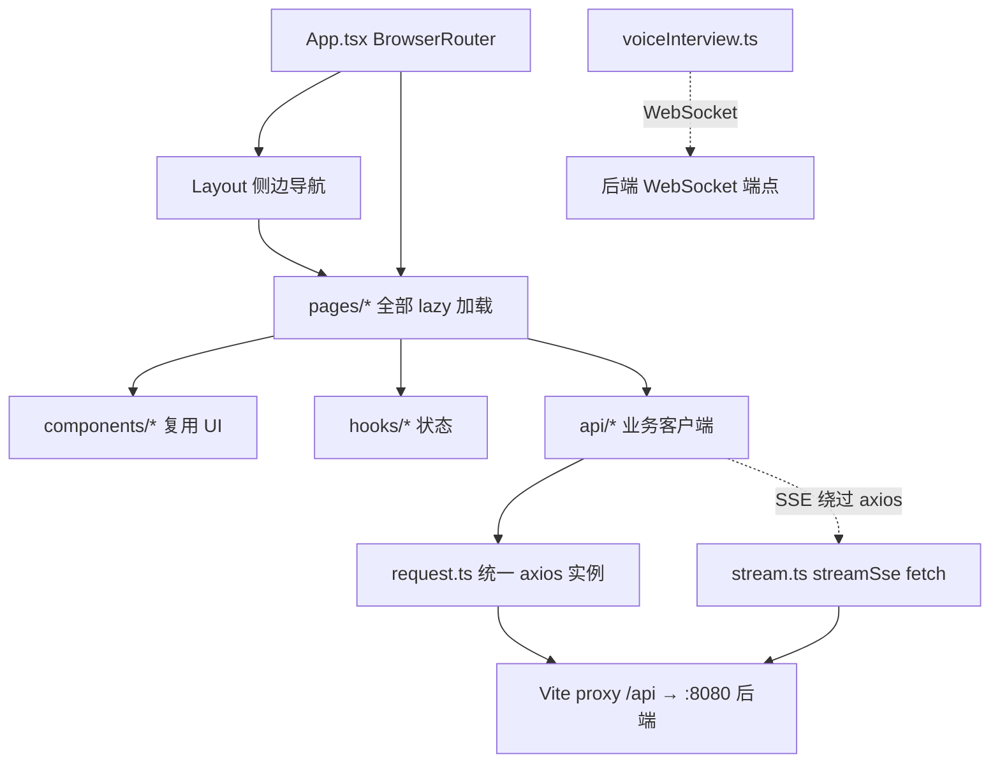
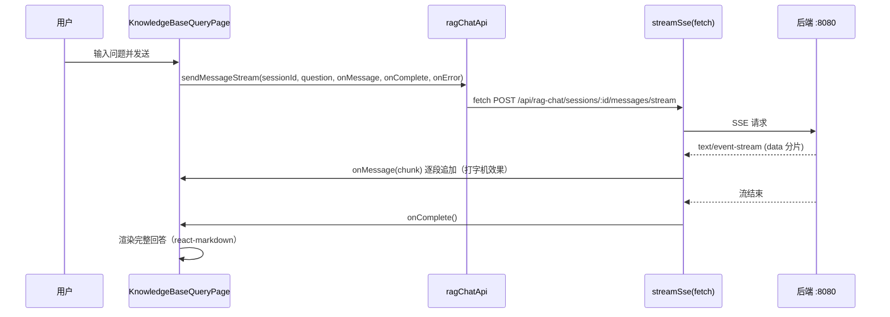

# 模块：frontend（Dossier）

> 路径：`frontend/src`
> 规模：约 17990 行 · 85 个 TS/TSX 文件 · 主要语言：TypeScript / React

## 1. 定位
InterviewGuide 智能 AI 面试官平台的前端单页应用（SPA）。基于 React 18.3 + TypeScript 5.6 + Vite 5.4 + Tailwind CSS 4 + react-router-dom 7.11，包管理器 pnpm。负责简历库、模拟（文本/语音）面试、知识库管理与题库面试、RAG 问答助手、面试日程与多模型/语音设置等全部交互，所有业务数据通过对 `http://localhost:8080` 的 `/api` 代理（vite.config.ts `server.proxy`）访问 Spring Boot 4.1 / Java 25 后端。

## 2. 关键文件清单

| 分组 | 文件路径 | 一句话作用 |
|------|----------|------------|
| api | `src/api/request.ts` | 统一 axios 实例 + `Result<T>` 响应拦截与解包；`upload`/`download`/`getErrorMessage` |
| api | `src/api/interview.ts` | 文本面试会话：创建/题目/提交答案/报告/暂存/提前交卷 |
| api | `src/api/knowledgebase.ts` | 知识库上传/列表/分类/题目生成与 CRUD/面试容量/问答（含 SSE） |
| api | `src/api/voiceInterview.ts` | 语音面试会话 REST + `VoiceInterviewWebSocket` 类（音频/字幕流） |
| api | `src/api/ragChat.ts` | RAG 问答会话管理 + `sendMessageStream`（SSE） |
| api | `src/api/stream.ts` | `streamSse`：基于 fetch 的 SSE 解析（line / event 两种模式） |
| api | `src/api/history.ts` | 简历列表/详情、面试详情、PDF 导出、统计、重分析 |
| api | `src/api/interviewSchedule.ts` | 面试日程解析/CRUD/状态变更 |
| api | `src/api/llmProvider.ts` | 多模型 Provider 与 ASR/TTS 语音配置 |
| api | `src/api/resume.ts` / `skill.ts` | 简历上传分析；技能主题与 JD 解析 |
| components | `src/components/Layout.tsx` | 侧边导航 + 主题切换 + 统一面试入口 Modal 容器 |
| components | `src/components/UnifiedInterviewModal.tsx` | 创建文本/语音面试的统一配置弹窗 |
| components | `src/components/InterviewDetailPanel.tsx` | 面试评估报告渲染（通用） |
| hooks | `src/hooks/useInterviewConfig.ts` | 面试配置状态（技能/难度/简历/JD 解析） |
| hooks | `src/hooks/useInterviewSchedule.ts` | 日程列表加载与增删改封装 |
| hooks | `src/hooks/useTheme.ts` | light/dark 主题，同步 `localStorage` 与 `document.documentElement` |
| pages | `src/pages/InterviewPage.tsx` | 文本模拟面试主流程（聊天式） |
| pages | `src/pages/VoiceInterviewPage.tsx` | 语音面试（WebSocket + 录音/字幕） |
| pages | `src/pages/KnowledgeBaseQueryPage.tsx` | RAG 问答助手（多会话 + SSE 流式） |
| constants | `src/constants/routes.ts` / `knowledgebaseInterview.ts` | 路由常量（仅 5 条，完整路由表在 `App.tsx`）；题库面试难度/状态选项 |
| utils | `src/utils/date.ts` / `score.ts` / `skillIcons.tsx` / `voiceInterview.ts` | 日期格式化、分数颜色/归一化、图标、模板名 |

## 3. 核心组件 / 函数 / 接口

### 3.1 页面组件

| 页面文件 | 路由 | 职责 |
|----------|------|------|
| `pages/HistoryPage.tsx` | `/history` | 简历库列表，上传状态、删除、进入详情 |
| `pages/ResumeDetailPage.tsx` | `/history/:resumeId` | 简历详情（分析面板 + 面试记录 + 开始面试） |
| `pages/InterviewHubPage.tsx` | `/interview-hub` | 面试中心首页，聚合最近面试与快捷入口 |
| `pages/InterviewPage.tsx` | `/interview`、`/interview/create/:requestId`、`/interview/session/:activeSessionId`、`/interview/:resumeId` | 文本模拟面试（题目生成→作答→报告） |
| `pages/InterviewHistoryPage.tsx` | `/interviews`、``/knowledgebase-interview/:id/interviews`` | 面试记录列表 + 统计图表（recharts） |
| `pages/KnowledgeBaseManagePage.tsx` | `/knowledgebase` | 知识库管理（列表/搜索/分类/删除/上传/问答） |
| `pages/KnowledgeBaseUploadPage.tsx` | `/knowledgebase/upload` | 知识库文件上传 |
| `pages/KnowledgeBaseInterviewLandingPage.tsx` | `/knowledgebase-interview` | 知识库面试落地页，选择题库 |
| `pages/KnowledgeBaseInterviewQuestionsPage.tsx` | `/knowledgebase-interview/:id/questions` | 题库管理、题目生成、开始面试配置 |
| `pages/KnowledgeBaseInterviewSessionPage.tsx` | `/knowledgebase-interview/:sessionId` | 知识库面试会话（复用 InterviewPage） |
| `pages/KnowledgeBaseQueryPage.tsx` | `/knowledgebase/chat` | RAG 问答助手（会话管理 + 流式） |
| `pages/UploadPage.tsx` | `/upload` | 简历上传并触发分析 |
| `pages/InterviewSchedulePage.tsx` | `/interview-schedule` | 面试日程日历（react-big-calendar） |
| `pages/SettingsPage.tsx` | `/settings` | 多模型 Provider 与 ASR/TTS 语音设置 |
| `pages/VoiceInterviewPage.tsx` | `/voice-interview` | 语音面试（WebSocket 实时音频/字幕） |
| `pages/VoiceInterviewEvaluationPage.tsx` | `/voice-interview/:sessionId/evaluation` | 语音评估报告（轮询 evaluateStatus） |

> `pages/` 另含 5 个纯逻辑 `.ts` 文件（每个都配一个同名 `.test.ts`，被 `node --test` 直接运行，不经过 Vite 打包）：`interviewEntry.ts`、`interviewHistoryStats.ts`、`questionGenerationStatus.ts`、`knowledgeBaseInterviewCompletion.ts`、`voiceEvaluationStatus.ts`。同类可测逻辑还有 `components/knowledgebaseInterview/interviewCapacity.ts`（同样带 `.test.ts`）。

### 3.2 可复用组件 / Hooks

| 名称 | 职责 |
|------|------|
| `UnifiedInterviewModal` | 文本/语音面试的统一创建配置弹窗 |
| `Layout` + `UnifiedInterviewModal` 容器 | 全局导航与 `openInterviewModalWithResume` OutletContext |
| `InterviewChatPanel` / `InterviewMessageBubble` / `InterviewPageHeader` | 文本面试聊天 UI 与消息气泡 |
| `InterviewDetailPanel` / `AnalysisPanel` / `InterviewPanel` | 评估报告、简历分析、面试记录渲染 |
| `AudioRecorder` / `AudioPlayer` / `RealtimeSubtitle` | 语音录制、播放、实时字幕 |
| `RadarChart` / `ScoreProgressBar` / `CodeBlock` | recharts 雷达图、分数进度、代码高亮（react-syntax-highlighter） |
| `ConfirmDialog` / `DeleteConfirmDialog` / `FileUploadCard` / `HistoryList` | 通用确认、删除确认、上传卡片、简历列表 |
| `interviewschedule/*` | 日历（ScheduleCalendar）、表单项、列表、错误边界 |
| `knowledgebaseInterview/*` | 题目卡片、生成题目 Modal、开始面试 Modal 等 |
| `useInterviewConfig` / `useInterviewSchedule` / `useTheme` | 面试配置、日程、主题状态管理 |
| `src/api/stream.ts` 的 `streamSse` | 基于 fetch 的 SSE 流式解析（被 ragChat/knowledgebase 复用） |
| `src/api/voiceInterview.ts` 的 `VoiceInterviewWebSocket` | 语音面试 WebSocket 管理（含断线重连） |

### 3.3 API 客户端

| api 文件 | 封装的后端接口域 |
|----------|------------------|
| `request.ts` | 统一 axios 实例、拦截器、上传/下载 |
| `interview.ts` | `/api/interview/sessions`、`/skills`、`/skills/parse-jd` |
| `history.ts` | `/api/resumes`、`/api/interview/sessions/:id/details`、PDF 导出 |
| `interviewSchedule.ts` | `/api/interview-schedule`、`/api/interview-schedule/parse` |
| `knowledgebase.ts` | `/api/knowledgebase/**`、`/api/knowledgebase-interviews/sessions`、`/api/knowledgebase/query(/stream)` |
| `llmProvider.ts` | `/api/llm-provider/**`、`/api/llm-provider/voice/{asr,tts}` |
| `ragChat.ts` | `/api/rag-chat/sessions/**`、`/messages/stream` |
| `resume.ts` | `/api/resumes/upload`、`/api/resumes/health` |
| `skill.ts` | `/api/interview/skills`、`/api/interview/skills/parse-jd` |
| `voiceInterview.ts` | `/api/voice-interview/sessions/**` |
| `stream.ts` | SSE 流（fetch，非 axios） |

## 4. 内部架构图（按需）



## 5. 依赖关系

### 5.1 被谁依赖（调用方）
- `request.ts`：被所有 `api/*.ts` 依赖，是唯一的 HTTP 出口。
- `api/*`：被对应 `pages/*`、部分 `components/*`（如 `UnifiedInterviewModal`）与 `hooks/*`（`useInterviewConfig` 调 skillApi/historyApi、`useInterviewSchedule` 调 interviewScheduleApi）依赖。
- `constants/routes.ts`：只导出 5 条被多处复用的路径常量（`interview` / `interviewCreate` / `interviewSession` / `resumeUpload` / `knowledgebaseUpload`）加 2 条 `ROUTE_PATTERNS`。**完整页面路由表在 `App.tsx`**，别把这里当路由总表。
- `utils/*`：被各页面与组件（分数/日期/图标）依赖。
- `pages/interviewHistoryStats.ts`、`voiceEvaluationStatus.ts`、`questionGenerationStatus.ts`、`knowledgeBaseInterviewCompletion.ts`、`interviewEntry.ts`：被 `pages/*` 导入，同时被 `package.json` 的 `node --test` 脚本直接运行。

### 5.2 依赖谁（被调用方）
- 后端 REST 接口（经 `/api` 代理）：见第 3.3 节各 api 文件对应的路径域。
- 后端 SSE 流：`/api/rag-chat/sessions/:id/messages/stream`（ragChat）、`/api/knowledgebase/query/stream`（knowledgebase）。
- 后端 WebSocket 语音端点：`createSession` 返回的 `webSocketUrl`（voiceInterview），用于实时音频/字幕双向传输。
- 外部库：axios（HTTP）、react-router-dom 7（路由）、tailwindcss 4（样式）、framer-motion（动画）、recharts（雷达/折线图）、react-big-calendar（日程）、react-virtuoso（长列表虚拟滚动）、react-markdown + remark-gfm（Markdown 渲染）、react-syntax-highlighter（代码块）、onnxruntime-web（VAD 本地语音检测，经 script 标签加载）、dayjs（日期）、lucide-react / react-icons（图标）。

## 6. 数据流

典型交互：RAG 问答 SSE 流式打字机（KnowledgeBaseQueryPage）。



文本/知识库面试的另一种典型流：开始面试 → `createSession`（幂等 requestId）→ 轮询/获取 `getCurrentQuestion` → `submitAnswer` 返回 `hasNextQuestion` → 完成后 `getReport` / 轮询 `evaluateStatus`。

## 7. 关键设计决策

- **统一 `Result<T>` 响应并在拦截器解包 → 理由**：后端约定所有响应为 HTTP 200 + `{code,message,data}`，拦截器在 `code===200` 时把 `response.data` 替换为 `data`，业务层直接拿到实体、错误统一走 `reject(message)`；**替代方案**：业务层各自判断 code，或后端改用 HTTP 状态码表达错误（当前后端统一 200，故拦截器方案最契合）。

- **SSE 走 fetch（`streamSse`）而非 axios 实例 → 理由**：axios 对 `ReadableStream` 流式读取支持弱，`streamSse` 用原生 `fetch` + `response.body.getReader()` 实现 line/event 两种解析，并复用 `parseResultPayload` 识别 JSON 错误帧；**替代方案**：使用 axios `onDownloadProgress` 手动切分——实现更复杂且难以正确处理 `event:` 多行块。

- **页面全量 `lazy()` 加载 + `Suspense` → 理由**：`App.tsx` 对所有 `pages/*` 与 `InterviewDetailPanel` 做动态导入，减小首屏包体（vite 还按 vendor 分包）；**替代方案**：静态 import 全部页面（首屏体积大）。

## 8. 测试覆盖 + 入门调用例子

### 8.1 测试覆盖
`package.json` scripts：
- `pnpm run build`：`tsc && vite build`（类型检查 + 构建）。
- `pnpm run test:e2e`：`playwright test`（端到端）。
- `pnpm run test:interview-history`：`node --test src/pages/interviewHistoryStats.test.ts`（面试统计纯函数）。
- `pnpm run test:question-generation`：`node --test src/pages/questionGenerationStatus.test.ts`（题目生成状态通知）。
- `pnpm run test:interview-capacity`：`node --test src/components/knowledgebaseInterview/interviewCapacity.test.ts`（面试容量计算）。
- `pnpm run test:interview-entry`：`node --test src/pages/interviewEntry.test.ts`（面试入口解析）。

> 单测对象均为 `src/` 下的纯逻辑 `.ts`（无 React 渲染），通过 `node --test` 直接执行，不依赖浏览器环境。

### 8.2 入门调用例子
以「文本模拟面试」为例，页面如何调用 API（伪代码）：

```ts
// pages/InterviewPage.tsx
import { interviewApi } from '../api/interview';

// 1) 创建会话（带幂等 requestId）
const session = await interviewApi.createSession({
  resumeText, questionCount, skillId, difficulty, requestId,
}); // → POST /api/interview/sessions

// 2) 获取首题
const q = await interviewApi.getCurrentQuestion(session.sessionId);

// 3) 作答并拿到下一题
const r = await interviewApi.submitAnswer({
  sessionId: session.sessionId, questionIndex: 0, answer,
}); // r.hasNextQuestion / r.nextQuestion

// 4) 完成后取报告
const report = await interviewApi.getReport(session.sessionId);
```

> **回到** [ARCHITECTURE.md](../ARCHITECTURE.md)
