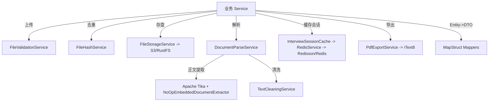
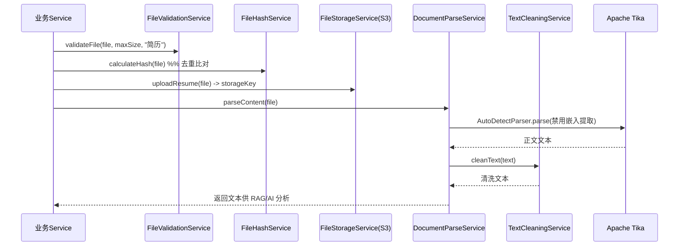

# 模块：infrastructure（Dossier）

> 路径：`app/src/main/java/interview/guide/infrastructure`
> 规模：约 2573 行 · 14 个文件 · 主要语言：Java

## 1. 定位
`infrastructure/` 是平台中可复用的技术能力层，集中存放与具体业务无关的横切基础设施：对象存储（S3 兼容）、文档解析（Apache Tika）、文本清洗、文件哈希/校验、Redis 缓存与分布式锁/Stream 队列、PDF 导出（iText 8）、Entity↔DTO 对象映射（MapStruct）。分包为 `file`、`redis`、`mapper`、`export`。项目约定：基础设施能力必须位于 `common/` 或 `infrastructure/`，禁止散落到业务 `Service`；Entity→DTO/Response 优先使用 MapStruct；禁止在数据库事务内做 S3 / LLM / 外部 HTTP 调用。

## 2. 关键文件清单

### file（文件处理）
| 文件路径 | 一句话作用 |
|---|---|
| `file/FileStorageService.java` | 基于 AWS S3 SDK 的对象存储封装，上传/下载/删除/存在性检查，文件名转拼音安全化 |
| `file/DocumentParseService.java` | 基于 Apache Tika 的通用文档解析，提取正文文本并联动文本清洗 |
| `file/FileHashService.java` | 计算文件 SHA-256 哈希，用于去重（支持字节数组与流式） |
| `file/FileValidationService.java` | 校验文件大小、MIME 类型、扩展名、知识库支持格式 |
| `file/TextCleaningService.java` | 解析后文本清洗：去噪、去控制字符、压缩空行、去 HTML |
| `file/ContentTypeDetectionService.java` | 基于 Tika `detect` 的 MIME 类型检测与格式判断 |
| `file/NoOpEmbeddedDocumentExtractor.java` | 禁用 Tika 嵌入文档（图片/附件）解析的空实现 |

### redis（缓存与队列）
| 文件路径 | 一句话作用 |
|---|---|
| `redis/RedisService.java` | Redisson 通用封装：KV、Hash、分布式锁、Stream 消息队列、原子计数器 |
| `redis/InterviewSessionCache.java` | 面试会话的 Redis 缓存模型与读写、进度/状态更新、未完成会话查找 |

### mapper（对象映射）
| 文件路径 | 一句话作用 |
|---|---|
| `mapper/RagChatMapper.java` | RAG 聊天会话/消息 Entity↔DTO 映射（依赖 KnowledgeBaseMapper） |
| `mapper/ResumeMapper.java` | 简历 Entity/分析 Entity↔DTO 映射，JSON 字段由 Service 层处理 |
| `mapper/InterviewMapper.java` | 面试会话/答案 Entity↔DTO 映射，JSON 字段由 Service 层处理 |
| `mapper/KnowledgeBaseMapper.java` | 知识库 Entity↔ListItemDTO 映射 |

### export（导出）
| 文件路径 | 一句话作用 |
|---|---|
| `export/PdfExportService.java` | iText 8 生成简历分析报告与面试报告 PDF，内嵌中文字体 |

## 3. 核心类 / 函数 / 接口

### 3.1 类
| 类名 | 职责 | 关键方法 |
|---|---|---|
| `FileStorageService` | S3 兼容存储封装 | `uploadResume`、`uploadKnowledgeBase`、`downloadFile`、`deleteResume`、`deleteKnowledgeBase`、`fileExists`、`getFileSize`、`getFileUrl`、`ensureBucketExists` |
| `DocumentParseService` | Tika 文档解析 | `parseContent(MultipartFile)`、`parseContent(byte[],fileName)`、`downloadAndParseContent(FileStorageService,key,name)` |
| `FileHashService` | SHA-256 哈希 | `calculateHash(MultipartFile)`、`calculateHash(byte[])`、`calculateHash(InputStream)` |
| `FileValidationService` | 文件校验 | `validateFile`、`validateContentTypeByList`、`validateContentType`、`isMarkdownExtension`、`isKnowledgeBaseMimeType` |
| `TextCleaningService` | 文本清洗 | `cleanText`、`cleanTextWithLimit`、`cleanToSingleLine`、`stripHtml` |
| `ContentTypeDetectionService` | MIME 检测 | `detectContentType(…)` ×3、`isPdf`、`isWordDocument`、`isPlainText`、`isMarkdown` |
| `NoOpEmbeddedDocumentExtractor` | 禁用嵌入解析 | `shouldParseEmbedded`（恒 false）、`parseEmbedded`（空实现） |
| `RedisService` | Redis 封装 | `set`/`get`/`getOrLoad`、`hSet`/`hGet`、`tryLock`/`executeWithLock`、`streamConsumeMessages`、`streamAdd`、`streamAck`、`increment`/`decrement`、`deleteByPattern` |
| `InterviewSessionCache` | 会话缓存 | `saveSession`、`getSession`、`updateSessionStatus`、`updateCurrentIndex`、`updateQuestions`、`deleteSession`、`findUnfinishedSessionId`、`refreshSessionTTL` |
| `PdfExportService` | PDF 导出 | `exportResumeAnalysis(ResumeEntity,ResumeAnalysisResponse)`、`exportInterviewReport(InterviewSessionEntity)` |
| `RagChatMapper` | RAG 映射（接口） | `toSessionDTO`、`toMessageDTO`、`toSessionListItemDTO`、`toSessionDetailDTO`（默认方法） |
| `ResumeMapper` | 简历映射（接口） | `toScoreDetail`、`toListItemDTO`、`toDetailDTOBasic`、`toAnalysisEntity`、`updateAnalysisEntity` |
| `InterviewMapper` | 面试映射（接口） | `toQuestionEvaluation`、`toDetailDTO`、`updateSessionFromReport`、`toInterviewHistoryItem` |
| `KnowledgeBaseMapper` | 知识库映射（接口） | `toListItemDTO`、`toListItemDTOList` |

### 3.2 函数（无类）
本模块无独立静态工具类函数（均为 `@Service` / `@Mapper` 成员方法）。`FileStorageService` 内含私有 `sanitizeFilename`/`convertToPinyin`（pinyin4j 汉字转大驼峰拼音）、`RedisService` 内含 `@FunctionalInterface LockedOperation`/`StreamMessageProcessor`，`InterviewSessionCache` 内含内部类 `CachedSession`（Serializable）。

### 3.3 对外契约
| 调用方场景 | 方法签名 |
|---|---|
| 上传并存储简历 | `String FileStorageService.uploadResume(MultipartFile)` |
| 校验上传文件 | `void FileValidationService.validateFile(MultipartFile, long maxSizeBytes, String fileTypeName)` |
| 计算去重哈希 | `String FileHashService.calculateHash(MultipartFile)` |
| 解析文档文本 | `String DocumentParseService.parseContent(MultipartFile)` |
| 从存储取回并解析 | `String DocumentParseService.downloadAndParseContent(FileStorageService, String storageKey, String originalFilename)` |
| 缓存面试会话 | `void InterviewSessionCache.saveSession(String sessionId, String resumeText, Long resumeId, Long kbId, String category, List<InterviewQuestionDTO>, int currentIndex, SessionStatus)` |
| 取分布式锁执行 | `<T> T RedisService.executeWithLock(String, long, long, TimeUnit, LockedOperation<T>)` |
| 入队 Stream 消息 | `String RedisService.streamAdd(String streamKey, Map<String,String> message, int maxLen)` |
| 导出简历分析 PDF | `byte[] PdfExportService.exportResumeAnalysis(ResumeEntity, ResumeAnalysisResponse)` |
| 导出面试报告 PDF | `byte[] PdfExportService.exportInterviewReport(InterviewSessionEntity)` |
| Entity→DTO | 例：`ResumeListItemDTO ResumeMapper.toListItemDTOBasic(ResumeEntity)`；`KnowledgeBaseListItemDTO KnowledgeBaseMapper.toListItemDTO(KnowledgeBaseEntity)` |

## 4. 内部架构图（按需）


## 5. 依赖关系

### 5.1 被谁依赖（调用方）
- `modules/resume`、`modules/knowledgebase`、`modules/interview`、`modules/rag` 等业务 Service 调用 `file/*`、`redis/*`、`export/*`、`mapper/*`。
- `InterviewSessionCache` 依赖 `modules.interview.model.InterviewQuestionDTO`、`InterviewSessionDTO.SessionStatus`。
- `mapper/*` 依赖各 `modules/*/model` 下的 Entity 与 DTO；`RagChatMapper` 通过 `uses = KnowledgeBaseMapper.class` 复用知识库映射。
- `PdfExportService` 依赖 `modules.interview.model.*` 与 `modules.resume.model.ResumeEntity`、`ResumeAnalysisResponse`。

### 5.2 依赖谁（被调用方 + 外部库）
- 内部：`common/`（StorageConfigProperties、BusinessException、ErrorCode）；`redis/RedisService` 被 `InterviewSessionCache` 依赖。
- 外部库：
  - **Apache Tika**（`DocumentParseService`、`ContentTypeDetectionService`、`NoOpEmbeddedDocumentExtractor`）— 文档解析与 MIME 检测。
  - **iText 8**（`export/PdfExportService`）— PDF 生成。
  - **AWS S3 SDK / RustFS**（`FileStorageService`，`app.storage.*` 配置 `http://localhost:9000`）— 对象存储。
  - **Redisson**（`RedisService`、`InterviewSessionCache`，`spring.redis.redisson` 配置）— Redis 客户端。
  - **MapStruct**（`mapper/*`，`componentModel=spring`）— 编译期对象映射。
  - pinyin4j（`FileStorageService` 文件名拼音化，非用户显式列出的辅助库）。

## 6. 数据流


## 7. 关键设计决策
- **决策 → 解析时禁用嵌入文档提取（`NoOpEmbeddedDocumentExtractor` + `PDFParserConfig.extractInlineImages=false`）→ 理由**：避免 Tika 抽取图片引用与临时 `file://` 路径污染正文、减少解析开销，配合 `TextCleaningService` 进一步去噪，保证送入 RAG/LLM 的文本质量；**替代方案**：默认提取全部嵌入资源（更易泄露路径且体积膨胀）。
- **决策 → 文件名汉字转大驼峰拼音（`pinyin4j`）+ S3 key 按 `prefix/yyyy/MM/dd/uuid_安全名` 组织 → 理由**：消除 S3 键中的非 ASCII/特殊字符，避免存储与下载异常，且按日期分片便于生命周期管理；**替代方案**：保留原始 UTF-8 文件名（部分网关/S3 兼容实现对中文键支持不稳）。

## 8. 测试覆盖 + 入门调用例子

### 8.1 测试覆盖
`app/src/test/java/interview/guide/infrastructure/` 下 4 个测试类（外加 1 个 `README.md`，非测试类）：
- `file/DocumentParseServiceTest`：单元（Mock）测试，15+ 方法，覆盖 TXT/MD 解析、空文件、特殊字符、中文、URL、文本清理调用验证、下载解析、IO 异常。
- `file/DocumentParseIntegrationTest`：集成测试，10+ 方法，真实文件端到端解析、多语言、大文件性能、纯噪音文档。
- `file/FileStorageServiceTest`：存储服务相关测试（上传/下载/删除/存在性）。
- `file/TextCleaningServiceTest`：文本清洗各正则规则单测。
- `file/README.md`：测试清单与运行方式（`./gradlew test --tests "*DocumentParseService*"`）。
- 覆盖缺口（README 标注）：PDF/DOCX/DOC 真实文件解析、Tika 解析异常、超过 5MB 限制、超大文件等尚未覆盖；`redis/*`、`mapper/*`、`export/*` 当前无对应测试类。

### 8.2 入门调用例子
```java
// 1) 上传简历并解析文本（业务侧典型流程）
String storageKey = fileStorageService.uploadResume(multipartFile);
String text = documentParseService.downloadAndParseContent(fileStorageService, storageKey, multipartFile.getOriginalFilename());

// 2) 导出面试报告 PDF（由 Controller 直接写响应流）
byte[] pdf = pdfExportService.exportInterviewReport(sessionEntity);
// 3) MapStruct 自动注入使用
ResumeListItemDTO dto = resumeMapper.toListItemDTOBasic(resumeEntity);
// 4) 带锁执行（Redisson 分布式锁）
redisService.executeWithLock("kb:index:" + kbId, 0, 30, TimeUnit.SECONDS, () -> doIndex());
```

> **回到** [ARCHITECTURE.md](../ARCHITECTURE.md)
