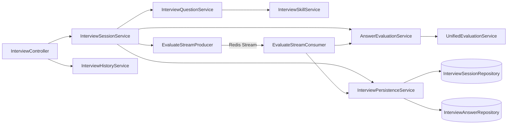
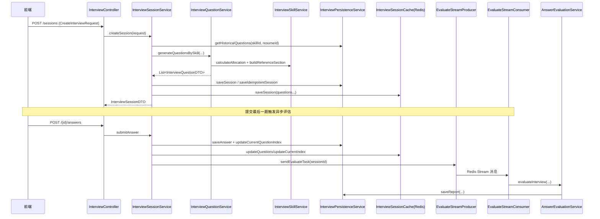

# 模块：interview（Dossier）

> 路径：`app/src/main/java/interview/guide/modules/interview`
> 规模：约 4048 行 · 27 个文件 · 主要语言：Java

## 1. 定位
文字面试（模拟面试）模块，承载「AI 面试官」的完整生命周期：Skill 驱动出题、JD 解析、历史题目去重、多轮智能追问、阶段时长联动、异步评估、报告生成与 PDF 导出、面试历史查询。评估能力复用 `common/evaluation/UnifiedEvaluationService`，与语音面试共用。资源侧依赖 `resources/skills/<方向>/SKILL.md` 与 `resources/prompts/interview-*.st`。对外通过 `InterviewController`、`InterviewSkillController` 暴露 REST API，前端调用入口在 `frontend/src/api/interview.ts`。

内置 **10 个面试方向**（`app/src/main/resources/skills/` 下各占一个目录，另有 `_shared/` 存放跨方向公共 references）：`java-backend`、`java-backend-tencent`、`ali-backend`、`bytedance-backend`、`frontend`、`python-backend`、`algorithm`、`system-design`、`test-development`、`ai-agent-dev`。新增方向只需加目录，无需改 Java 代码。

## 2. 关键文件清单
| 文件路径 | 一句话作用 |
| --- | --- |
| `InterviewController.java` | 面试会话 REST 入口（创建/问答/报告/导出/删除） |
| `skill/InterviewSkillService.java` | Skill 注册、分类分配、references 注入、JD 解析 |
| `skill/InterviewSkillController.java` | Skill 列表 / 详情 / JD 解析 REST 入口 |
| `service/InterviewSessionService.java` | 会话生命周期编排（缓存优先、幂等创建、异步评估触发） |
| `service/InterviewQuestionService.java` | 基于 Skill 出题（并行：简历题 60% + 方向题 40%） |
| `service/AnswerEvaluationService.java` | DTO 适配器，调用 `UnifiedEvaluationService` |
| `service/InterviewPersistenceService.java` | 会话/答案/报告的 JPA 持久化与历史题去重 |
| `service/InterviewHistoryService.java` | 会话详情组装 + PDF 导出 |
| `listener/EvaluateStreamProducer.java` | 评估任务入队 Redis Stream |
| `listener/EvaluateStreamConsumer.java` | 消费 Redis Stream 执行异步评估 |

## 3. 核心类 / 函数 / 接口
### 3.1 类
- `InterviewController`：`@RestController`，持有 `sessionService`、`historyService`、`persistenceService`。
- `InterviewSessionService`：核心编排，`getOrRestoreSession` 优先读 Redis（`InterviewSessionCache`），未命中从 PostgreSQL 恢复。
- `InterviewQuestionService`：无简历走 `generateDirectionOnly`；有简历走 `generateResumeQuestions` + `generateDirectionOnly` 并行（`Executors.newVirtualThreadPerTaskExecutor()`），比例 `RESUME_QUESTION_RATIO=0.6`；失败分别降级为全方向题 / 默认题（`generateFallbackQuestions`）。
- `InterviewSkillService`：`@PostConstruct loadPresetSkills` 从 `classpath:skills/*/SKILL.md` 加载预设 Skill（忽略 `_shared`）；`calculateAllocation` 按 `ALWAYS_ONE/CORE/normal` 优先级分配题量；`parseJd` 调 LLM 解析 JD 为分类；`buildReferenceSection` 注入 references（截断 `MAX_REFERENCE_SECTION_CHARS=12000`）。
- `AnswerEvaluationService`：将 `InterviewQuestionDTO` 映射为通用 `QaRecord`，调用 `UnifiedEvaluationService.evaluate`，再转回 `InterviewReportDTO`。
- `EvaluateStreamProducer/Consumer`：继承 `AbstractStreamProducer/Consumer`，Stream Key 来自 `AsyncTaskStreamConstants.INTERVIEW_EVALUATE_STREAM_KEY`。
- 模型：`InterviewSessionEntity`（表 `interview_sessions`，`questionsJson` 存题、`evaluateStatus` 异步状态）、`InterviewAnswerEntity`（级联删除）、`InterviewQuestionDTO`（record，含 `isFollowUp`/`parentQuestionIndex`/`referenceAnswer`）、`InterviewReportDTO`、`CreateInterviewRequest`（题目数 3-20）。

### 3.2 函数（无类）
- `InterviewSessionService.createIdempotentSession`：基于 `requestId` 的 Redis 锁 + 结果缓存（`CREATE_RESULT_PREFIX`，TTL 1 天）实现幂等。
- `InterviewSkillService.calculateAllocation(...)`：题量分配算法。
- `InterviewQuestionService.mergeQuestionBatches(first, second)`：合并两批题并偏移 `questionIndex`/`parentQuestionIndex`。
- `InterviewPersistenceService.getHistoricalQuestions(skillId, resumeId)`：加载近 10 个历史会话主问题，去重后上限 `MAX_HISTORICAL_QUESTIONS=60`。

### 3.3 HTTP 接口
`InterviewController`（`/api/interview/sessions`）：`GET` 列会话、`POST` 创建、`GET /{id}` 取会话、`GET /{id}/question` 取当前题、`POST /{id}/answers` 提交答案、`PUT /{id}/answers` 暂存、`POST /{id}/complete` 提前交卷、`GET /{id}/report` 报告、`GET /{id}/details` 详情、`GET /{id}/export` PDF、`GET /{id}/unfinished/{resumeId}` 找未完成、`DELETE /{id}` 删除。
`InterviewSkillController`（`/api/interview/skills`）：`GET` 列表、`GET /{id}` 详情、`POST /parse-jd` JD 解析（`@RateLimit IP 5`）。

## 4. 内部架构图（按需）


## 5. 依赖关系
### 5.1 被谁依赖（调用方）
- `frontend/src/api/interview.ts` 通过 REST 调用本模块。
- `InterviewSessionService` 被 `InterviewController`、`InterviewSkillController` 间接经 `createSessionFromQuestions`（知识库面试入口）调用。
- 评估逻辑被 `EvaluateStreamConsumer`（同模块）复用。

### 5.2 依赖谁（被调用方）
- `common/evaluation/UnifiedEvaluationService`：通用评估引擎（文字 + 语音共用）。
- `common/ai`：`LlmProviderRegistry`、`PromptSanitizer`、`StructuredOutputInvoker`、`PromptSecurityConstants`。
- `infrastructure/redis`：`InterviewSessionCache`、`RedisService`。
- `infrastructure/export/PdfExportService`、`infrastructure/mapper/InterviewMapper`：PDF 与 MapStruct 映射。
- `modules/resume`：`ResumeEntity`、`ResumeRepository`（关联简历，可选）。
- 外部资源：`resources/skills/*/SKILL.md`、`skill.meta.yml`、`references/*`、`resources/prompts/interview-*.st`、`prompts/jd-parse-system.st`。

## 6. 数据流


## 7. 关键设计决策
- **决策 → 缓存优先 + 数据库兜底恢复 → 理由**：高频问答读路径走 Redis（`InterviewSessionCache`），降低 PostgreSQL 压力；每次读取未命中即从 JSON 字段重建到缓存，保证进程重启后可恢复，且“先落库再写易失缓存”避免幂等创建脏数据。**替代方案**：纯数据库会话状态（高频序列化开销大）、纯内存缓存（进程崩溃丢状态）。
- **决策 → 出题与评估异步解耦（Redis Stream + 消费者） → 理由**：评估 LLM 调用耗时长，提交答案仅做落库并 `enqueueEvaluationTask` 入队，消费者异步执行并回写报告，避免阻塞前端；`evaluateStatus`（`PENDING/PROCESSING/COMPLETED/FAILED`）可前端轮询。`onSendFailed`/`retryMessage` 提供失败重试与降级。**替代方案**：同步评估（请求超时）、线程池后台跑（无消费确认/重试语义）。

## 8. 测试覆盖 + 入门调用例子
### 8.1 测试覆盖
`app/src/test/java/interview/guide/modules/interview/` 含 4 个测试：
- `service/InterviewSessionIdempotencyTest`：验证 Redis 结果映射丢失时从 DB 恢复同一会话、不重复调 LLM。
- `service/InterviewPersistenceServiceTest`：持久化/历史题去重逻辑。
- `service/AnswerEvaluationServiceTest`：DTO 适配与评估映射。
- `model/SessionListItemDTOTest`：列表项映射。
（注：出题 LLM 调用、PDF 导出、Stream 消费未在此目录覆盖，依赖外部服务或需集成环境。）

### 8.2 入门调用例子
```bash
# 1) 创建会话（自定义方向需先 /parse-jd）
curl -X POST /api/interview/sessions \
  -H 'Content-Type: application/json' \
  -d '{"resumeText":"","questionCount":8,"skillId":"java-backend","difficulty":"mid"}'

# 2) 取当前题
curl /api/interview/sessions/{sessionId}/question

# 3) 提交答案（最后一题触发异步评估）
curl -X POST /api/interview/sessions/{sessionId}/answers \
  -H 'Content-Type: application/json' -d '{"questionIndex":0,"answer":"..."}'

# 4) 轮询并获取报告
curl /api/interview/sessions/{sessionId}/report

# 5) 导出 PDF
curl /api/interview/sessions/{sessionId}/export -o report.pdf
```

> **回到** [ARCHITECTURE.md](../ARCHITECTURE.md)
