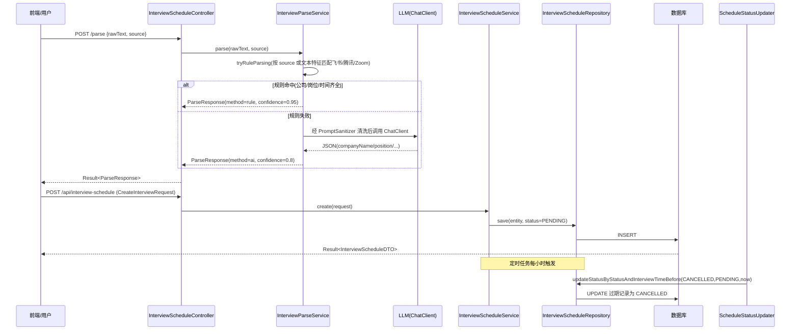

# 模块：interviewschedule（Dossier）

> 路径：`app/src/main/java/interview/guide/modules/interviewschedule`
> 规模：约 870 行 · 11 个文件 · 主要语言：Java

## 1. 定位

面试日程管理模块，是 InterviewGuide 平台中负责「面试邀请解析」与「日程/状态管理」的边界模块。承担两类职责：

- **面试邀请解析**：接收飞书 / 腾讯会议 / Zoom 等平台格式的邀约文本，通过「正则规则 + AI」双引擎提取公司名称、岗位、时间、会议链接、轮次等信息，输出结构化 `CreateInterviewRequest`。
- **日程与状态管理**：提供面试记录的增删改查、日历式时间调整、状态流转（PENDING / COMPLETED / CANCELLED / RESCHEDULED），并由定时任务自动将过期面试标记为 CANCELLED。

前端（`frontend/src/pages/InterviewSchedulePage.tsx` 等）通过该模块暴露的 REST 接口驱动日/周/月/列表视图与拖拽调整。

## 2. 关键文件清单

| 文件路径 | 一句话作用 |
|---------|-----------|
| `InterviewScheduleController.java` | REST 控制器，暴露解析、CRUD、状态更新接口 |
| `service/InterviewParseService.java` | 双引擎解析核心：正则规则 + Spring AI 调用，435 行 |
| `service/InterviewScheduleService.java` | 面试记录的持久化 CRUD 与状态更新 |
| `service/ScheduleStatusUpdater.java` | `@Scheduled` 定时任务，批量过期 PENDING 记录 |
| `repository/InterviewScheduleRepository.java` | Spring Data JPA 仓储，含按状态/时间查询与批量更新 |
| `model/InterviewScheduleEntity.java` | JPA 实体，映射 `interview_schedule` 表 |
| `model/InterviewScheduleDTO.java` | 对外传输对象 |
| `model/CreateInterviewRequest.java` | 创建/更新/解析结果的请求载荷（注意与 `modules/interview` 同名类区分） |
| `model/ParseRequest.java` / `ParseResponse.java` | 解析接口入参（rawText + source）与结果（data + confidence + parseMethod） |
| `model/InterviewStatus.java` | 状态枚举：PENDING / COMPLETED / CANCELLED / RESCHEDULED |

## 3. 核心类 / 函数 / 接口

### 3.1 类

| 类名 | 职责 | 关键方法 |
|------|------|---------|
| `InterviewScheduleController` | HTTP 入口，转发到两个 Service | `parse`、`create`、`getById`、`getAll`、`update`、`delete`、`updateStatus` |
| `InterviewParseService` | 规则 + AI 双引擎解析 | `parse(rawText, source)`、`tryRuleParsing`、`parseFeishu/Tencent/Zoom`、`parseWithAI` |
| `InterviewScheduleService` | 面试记录持久化与状态流转 | `create`、`update`、`delete`、`updateStatus`、`getAll(status,start,end)`、`getById` |
| `ScheduleStatusUpdater` | 定时批量过期 | `updateExpiredInterviews()`（cron `0 0 * * * ?`） |
| `InterviewScheduleRepository` | JPA 数据访问 | `findByStatus`、`findByInterviewTimeBetween`、`findByStatusAndInterviewTimeBefore`、`updateStatusByStatusAndInterviewTimeBefore` |

### 3.2 函数（无类）

本模块无独立静态工具类方法；日期与轮次解析辅助逻辑（`parseDateTime`、`parseRoundNumber`、`isValidResult`）均封装在 `InterviewParseService` 私有方法中，职责已并入 3.1。

### 3.3 HTTP 接口

| 方法 | 路径 | 作用 |
|------|------|------|
| POST | `/api/interview-schedule/parse` | 解析邀约文本，返回 `ParseResponse` |
| POST | `/api/interview-schedule` | 创建面试记录（默认状态 PENDING） |
| GET | `/api/interview-schedule/{id}` | 按 ID 获取详情 |
| GET | `/api/interview-schedule` | 列表查询，支持 `status` / `start` / `end` 过滤 |
| PUT | `/api/interview-schedule/{id}` | 全量更新（保留原 status） |
| DELETE | `/api/interview-schedule/{id}` | 删除记录 |
| PATCH / PUT | `/api/interview-schedule/{id}/status` | 手动更新状态（Query 参数 `status`） |

## 4. 内部架构图（按需）

本模块为清晰的 Spring 分层：Controller 调度两个 Service；`InterviewScheduleService` 经 Repository 落库；`ScheduleStatusUpdater` 直接复用同一 Repository 做定时批量写。`InterviewParseService` 独立于日程持久化，仅产出 `CreateInterviewRequest`。结构明确，无需额外结构图，跳过。

## 5. 依赖关系

### 5.1 被谁依赖（调用方）

- 前端 `frontend/src/api/interviewSchedule.ts`：`interviewScheduleApi` 封装全部 7 个接口。
- 前端 `frontend/src/hooks/useInterviewSchedule.ts`：以 hook 形式消费上述 API，支撑 `InterviewSchedulePage.tsx` 的日历/列表/表单视图。
- 模块内部：`ScheduleStatusUpdater` 依赖 `InterviewScheduleRepository`；`InterviewScheduleController` 依赖两个 Service。

### 5.2 依赖谁（被调用方）

- `common/ai/LlmProviderRegistry`：`getChatClientOrDefault(provider)` 获取 `ChatClient`（AI 解析兜底）。
- `common/ai/PromptSanitizer` 与 `common/ai/PromptSecurityConstants`：对原始文本做清洗与注入边界包裹（`DATA_BOUNDARY_INSTRUCTION` + `wrapWithDelimiters`）。
- `common/result.Result`：统一响应包装。
- `common/exception.BusinessException` / `ErrorCode.INTERVIEW_SCHEDULE_NOT_FOUND`：记录不存在时抛业务异常。
- `infrastructure`（Spring Data JPA / 数据库）：`InterviewScheduleEntity` 持久化与查询。

## 6. 数据流



## 7. 关键设计决策

**决策 → 规则解析优先、AI 解析兜底（双引擎）**
→ 理由：飞书/腾讯会议/Zoom 的邀约文本结构固定，正则规则零延迟、确定性高、可离线；仅当规则无法凑齐公司/岗位/时间三要素时，才调用 LLM 处理自由格式文本，兼顾成本与召回。
→ 替代方案：纯 AI 解析——每条请求都走 LLM，延迟与 token 成本高且对标准模板不必要；纯规则——无法覆盖不规则或合并通知类文本，漏解析率高。

**决策 → 过期状态由 `@Scheduled` 定时任务批量落库（CANCELLED）**
→ 理由：`ScheduleStatusUpdater` 每小时将 `status=PENDING` 且 `interviewTime < now` 的记录批量更新为 `CANCELLED`，使过期状态持久化，便于日历过滤与统计，不依赖查询时计算。
→ 替代方案：查询时在应用层按当前时间即时判定「过期」——状态不落库，无法统计历史过期数，且每次查询都要遍历比较。

（补充：AI 解析路径对 `rawText` 使用 `PromptSanitizer` 清洗并以 `DATA_BOUNDARY_INSTRUCTION` 包裹，属于对提示注入的防御性设计。）

## 8. 测试覆盖 + 入门调用例子

### 8.1 测试覆盖

仓库 `app/src/test` 目录存在，但**未发现**任何针对本模块（`InterviewParseService` / `InterviewScheduleService` / `ScheduleStatusUpdater` / Controller）的单元测试或集成测试。解析逻辑（尤其正则与 AI 兜底分支）与定时过期任务目前无自动化验证，建议补充规则解析用例与 `@Scheduled` 行为的测试。

### 8.2 入门调用例子

解析一条飞书邀约（规则引擎命中，返回 confidence 0.95）：

```bash
curl -X POST /api/interview-schedule/parse \
  -H 'Content-Type: application/json' \
  -d '{"rawText":"时间：2026-04-10 14:00\n公司：字节跳动\n岗位：后端工程师\nhttps://meeting.feishu.cn/abc","source":"feishu"}'
```

拿到 `data` 后创建日程（前端 `useInterviewSchedule.createInterview` 等价调用）：

```bash
curl -X POST /api/interview-schedule \
  -H 'Content-Type: application/json' \
  -d '{"companyName":"字节跳动","position":"后端工程师","interviewTime":"2026-04-10T14:00:00","interviewType":"VIDEO","meetingLink":"https://meeting.feishu.cn/abc","roundNumber":1}'
```

日历视图拉取指定区间（前端默认进入即 `getAll()` 无参获取全量）：

```bash
curl '/api/interview-schedule?start=2026-04-01T00:00:00&end=2026-04-30T23:59:59'
```

手动标记状态（拖拽改时间走 `PUT /{id}`，状态切换走 PATCH）：

```bash
curl -X PATCH '/api/interview-schedule/1/status?status=COMPLETED'
```

> **回到** [ARCHITECTURE.md](../ARCHITECTURE.md)
