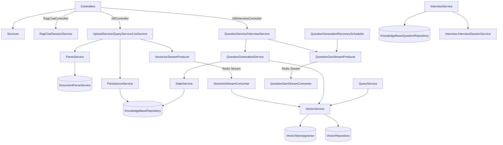
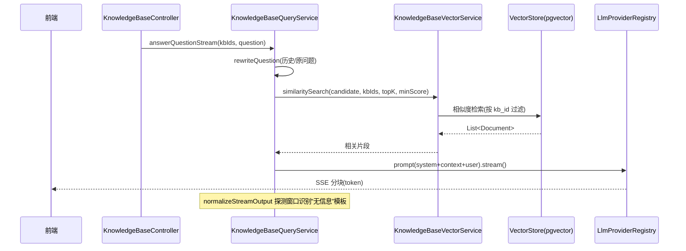

# 模块：knowledgebase（Dossier）

> 路径：`app/src/main/java/interview/guide/modules/knowledgebase`
> 规模：约 5514 行 · 49 个文件 · 主要语言：Java

## 1. 定位
负责知识库的文档上传解析与异步向量化、基于向量检索的 RAG 问答（SSE 流式 + 查询改写）、题库的异步 LLM 生成与 CRUD 管理，以及基于知识库题目的专项面试会话编排，是面试平台的「知识沉淀」与「领域问答」核心模块。

## 2. 关键文件清单
| 文件路径 | 一句话作用 |
| --- | --- |
| `KnowledgeBaseController.java` | 知识库增删查、分类、上传/下载/搜索/统计、RAG 非流式与流式查询入口 |
| `KnowledgeBaseInterviewController.java` | 题库 CRUD、题目生成提交/状态、专项面试会话与容量校验入口 |
| `RagChatController.java` | RAG 会话生命周期（创建/列表/详情/置顶/消息流式）入口 |
| `service/KnowledgeBaseUploadService.java` | 上传编排：校验→去重→解析→存储 RustFS→入队向量化 |
| `service/KnowledgeBaseVectorService.java` | 文本分块、`VectorStore` 向量化/检索、临时 job 提升与清理 |
| `service/KnowledgeBaseQueryService.java` | RAG 检索+LLM 回答，含 query rewrite 与动态 topK/流式探测 |
| `service/KnowledgeBaseQuestionGenerationService.java` | 题目异步生成：检索上下文→LLM→去重→落库 |
| `service/QuestionGenerationStateService.java` | 题目生成状态机的事务边界（幂等/锁/恢复） |
| `listener/VectorizeStreamConsumer.java` | 消费 Redis Stream 执行向量化 |
| `repository/VectorRepository.java` | 直接操作 pgvector 表 `vector_store` 的增删/提升 SQL |

## 3. 核心类 / 函数 / 接口
### 3.1 类
| 类名 | 职责 | 关键方法 |
| --- | --- | --- |
| `KnowledgeBaseUploadService` | 上传与重新向量化 | `uploadKnowledgeBase`, `revectorize` |
| `KnowledgeBaseParseService` | 解析委托给通用 `DocumentParseService` | `parseContent`, `downloadAndParseContent`, `detectContentType` |
| `KnowledgeBaseVectorService` | 分块/向量化/相似度检索 | `vectorizeAndStore`, `similaritySearch`, `deleteByKnowledgeBaseId` |
| `KnowledgeBaseQueryService` | RAG 问答 | `answerQuestion`, `answerQuestionStream`, `queryKnowledgeBase` |
| `KnowledgeBaseListService` | 列表/详情/分类/下载/统计 | `listKnowledgeBases`, `getKnowledgeBase`, `getStatistics` |
| `KnowledgeBaseDeleteService` | 删除知识库及关联 | `deleteKnowledgeBase` |
| `KnowledgeBaseCountService` | 提问计数批量更新 | `updateQuestionCounts` |
| `KnowledgeBasePersistenceService` | 事务性元数据存储 | `saveKnowledgeBase`, `handleDuplicateKnowledgeBase` |
| `KnowledgeBaseQuestionService` | 题库 CRUD + 生成提交 | `listQuestions`, `submitGenerationTask`, `createQuestion`, `updateStatus` |
| `KnowledgeBaseQuestionGenerationService` | 题目生成执行 | `executeGeneration` |
| `QuestionGenerationStateService` | 生成状态机 | `createTask`, `tryMarkProcessing`, `replaceQuestionsAndComplete`, `markFailed` |
| `KnowledgeBaseInterviewService` | 专项面试编排 | `createSession`, `getCapacity` |
| `RagChatSessionService` | RAG 会话仓储 + 流式回答 | `createSession`, `prepareStreamMessage`, `getStreamAnswer`, `completeStreamMessage` |
| `QuestionGenStreamProducer/Consumer` | 题目生成 Redis Stream 生产者/消费者 | `sendGenerateTask`, `processBusiness` |
| `VectorizeStreamProducer/Consumer` | 向量化 Redis Stream 生产者/消费者 | `sendVectorizeTask`, `processBusiness` |
| `QuestionGenerationRecoveryScheduler` | 卡住/丢失生成任务补偿 | `recoverStaleTasks`(@Scheduled) |
| `VectorRepository` / `KnowledgeBaseRepository` / `KnowledgeBaseQuestionRepository` / `RagChatSessionRepository` / `RagChatMessageRepository` | 数据访问 | JPA 方法 + `VectorRepository` 原生 SQL |

### 3.2 函数（无类）
无（全部逻辑封装在 Spring `@Service` / `@Component` / `@Repository` 类中）

### 3.3 HTTP 接口
| 方法 | 路径 | 作用 |
| --- | --- | --- |
| GET | `/api/knowledgebase/list` | 知识库列表（状态过滤+排序） |
| GET | `/api/knowledgebase/{id}` | 知识库详情 |
| DELETE | `/api/knowledgebase/{id}` | 删除知识库 |
| PUT | `/api/knowledgebase/{id}/category` | 修改知识库分类 |
| POST | `/api/knowledgebase/query` | RAG 非流式问答 |
| POST | `/api/knowledgebase/query/stream` | RAG 流式问答（SSE） |
| GET | `/api/knowledgebase/categories` | 所有分类 |
| GET | `/api/knowledgebase/category/{category}` | 按分类查询知识库 |
| GET | `/api/knowledgebase/uncategorized` | 未分类知识库 |
| POST | `/api/knowledgebase/upload` | 上传知识库文件 |
| GET | `/api/knowledgebase/{id}/download` | 下载源文件 |
| GET | `/api/knowledgebase/search` | 关键字搜索 |
| GET | `/api/knowledgebase/stats` | 统计信息 |
| POST | `/api/knowledgebase/{id}/revectorize` | 重新向量化 |
| GET | `/api/knowledgebase/{id}/questions` | 题库列表 |
| GET | `/api/knowledgebase/{id}/questions/categories` | 该知识库题库的分类列表 |
| POST | `/api/knowledgebase/{id}/questions/generate` | 提交题目生成 |
| GET | `/api/knowledgebase/{id}/questions/generation-status` | 生成状态 |
| POST | `/api/knowledgebase/{id}/questions` | 手动创建题目 |
| PUT | `/api/knowledgebase/questions/{questionId}` | 更新题目 |
| PUT | `/api/knowledgebase/questions/{questionId}/status` | 更新题目状态 |
| DELETE | `/api/knowledgebase/questions/{questionId}` | 删除题目 |
| POST | `/api/knowledgebase-interviews/sessions` | 创建专项面试会话 |
| GET | `/api/knowledgebase/{id}/interview-capacity` | 面试容量校验 |
| POST | `/api/rag-chat/sessions` | 创建 RAG 会话 |
| GET | `/api/rag-chat/sessions` | 会话列表 |
| GET | `/api/rag-chat/sessions/{sessionId}` | 会话详情 |
| PUT | `/api/rag-chat/sessions/{sessionId}/title` | 改标题 |
| PUT | `/api/rag-chat/sessions/{sessionId}/pin` | 置顶 |
| PUT | `/api/rag-chat/sessions/{sessionId}/knowledge-bases` | 改关联知识库 |
| DELETE | `/api/rag-chat/sessions/{sessionId}` | 删会话 |
| POST | `/api/rag-chat/sessions/{sessionId}/messages/stream` | 会话消息流式（SSE） |

## 4. 内部架构图（按需）


## 5. 依赖关系
### 5.1 被谁依赖（调用方）
- `modules/interview` 的 `InterviewSessionService`：被 `KnowledgeBaseInterviewService.createSession` 调用，承接面试会话落地。
- `frontend`：`knowledgebase.ts` / `ragChat.ts` 通过 REST 与 SSE 消费全部上述路由。
- `common` 的 `AbstractStreamProducer/Consumer`、`LlmProviderRegistry`、`StructuredOutputInvoker`、`FileStorageService`、`RedisService`：被本模块 listener 与 service 复用。

### 5.2 依赖谁（被调用方）
- `infrastructure/file`：`FileStorageService`(RustFS)、`FileValidationService`、`FileHashService`、`DocumentParseService`、`ContentTypeDetectionService`。
- `infrastructure/mapper`：`KnowledgeBaseMapper`、`RagChatMapper`（MapStruct）。
- `common/ai`：`LlmProviderRegistry`、`StructuredOutputInvoker`、`PromptSanitizer`（含 `DATA_BOUNDARY_INSTRUCTION`/`ANTI_INJECTION_INSTRUCTION`）。
- `common/transaction`：`TransactionalExecutor`（向量化/删除在事务内执行）。
- `common/async`：`AbstractStreamProducer/Consumer`；`common/constant/AsyncTaskStreamConstants`（Stream key/group 常量）。
- 存储：`VectorStore`(Spring AI pgvector)、`JdbcTemplate`(`VectorRepository`)、JPA 仓库、Redis Stream + Redisson。
- 模板：`resources/prompts/knowledgebase-*.st`（query-system/user/rewrite、question-generation-system/user）。

## 6. 数据流
典型操作：RAG 流式问答（`/api/knowledgebase/query/stream`）


## 7. 关键设计决策
- **向量化采用「临时 job → 提升」模式** → 理由：分批写入 `vector_store`（`metadata.kb_id = pending:<id>:<jobId>`），全部成功后 `VectorRepository.promoteVectorJob` 一次性把 `kb_id` 提升为正式值，失败时 `cleanupPendingVectorJob` 按 `kb_vector_job_id` 清理，避免部分可见的中间向量；检索用 `kb_id` 前置过滤，失败回退本地按 metadata 过滤。**替代方案**：逐条直接写正式 `kb_id` 会在写入中途对外暴露不完整知识库，重试/失败清理更复杂。
- **题目生成状态机 + 悲观锁 + 幂等 taskId** → 理由：`QuestionGenerationStateService` 用 `findByIdForUpdate`（PESSIMISTIC_WRITE）串行化状态迁移 `NONE→QUEUED→PROCESSING→COMPLETED/FAILED`，`replaceQuestionsAndComplete` 在小事务内「删除旧题+保存新题」；`kb.questionGenTaskId` 用于丢弃过期任务结果，`QuestionGenerationRecoveryScheduler` 定期补救卡住的 `QUEUED`/`PROCESSING` 任务。**替代方案**：乐观锁或仅用 Redis 标记易在节点崩溃后丢失状态、旧任务覆盖新任务。

## 8. 测试覆盖 + 入门调用例子
### 8.1 测试覆盖
`app/src/test/java/interview/guide/modules/knowledgebase/service/` 下 5 个测试类：
- `KnowledgeBaseVectorServiceTest`：分块、批量写入、相似度搜索。
- `KnowledgeBaseQuestionServiceTest`：题库 CRUD、状态流转、过滤。
- `KnowledgeBaseInterviewServiceTest`：容量校验、抽题/追问数量约束。
- `QuestionGenerationStateServiceTest`：状态机迁移、锁、失败/恢复。
- `QuestionGenerationAsyncTest`：Mockito 全链路——提交 `QUEUED`、Consumer 幂等领取、taskId 不匹配放弃、旧题替换、追问截断与去重、LLM 失败重入队。
（均为单元/Mock 测试，未涉及真实 Redis/LLM/pgvector 集成。）

### 8.2 入门调用例子
1. 上传并触发向量化：
   ```bash
   curl -F "file=@resume.pdf" -F "name=Java面经" localhost:8080/api/knowledgebase/upload
   # 返回 vectorStatus=PENDING，轮询 /api/knowledgebase/{id} 直到 COMPLETED
   ```
2. 流式问答（前端走 SSE）：
   ```ts
   import { knowledgeBaseApi } from '@/api/knowledgebase';
   knowledgeBaseApi.queryKnowledgeBaseStream(
     { knowledgeBaseIds: [1], question: 'HashMap 扩容机制？' },
     chunk => onMessage(chunk), () => onComplete(), e => onError(e));
   ```
3. 生成题库后开启专项面试：
   ```ts
   knowledgeBaseApi.generateQuestions(1, { difficulty: 'mid', questionCount: 8, followUpCount: 2 });
   knowledgeBaseApi.getInterviewCapacity(1, { difficulty: 'mid', mainQuestionCount: 5 });
   knowledgeBaseApi.createInterviewSession({ knowledgeBaseId: 1, difficulty:'mid', mainQuestionCount:5, followUpCount:2 });
   ```

> **回到** [ARCHITECTURE.md](../ARCHITECTURE.md)
