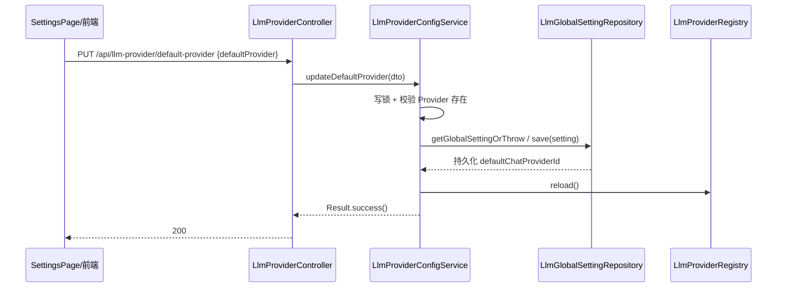

# 模块：llmprovider（Dossier）

> 路径：`app/src/main/java/interview/guide/modules/llmprovider`
> 规模：约 1883 行 · 17 个文件 · 主要语言：Java

## 1. 定位
多 Provider 管理与持久化模块。负责 OpenAI 兼容端点（DashScope / LM Studio / Kimi / DeepSeek / GLM 等）的增删改查、API Key 加密落盘、默认聊天模型与默认向量模型的切换、ASR/TTS 语音服务配置、Provider 连通性测试，以及应用启动时的预设 Provider 引导（seed）。运行期实际 LLM 调用由 `common/ai/LlmProviderRegistry` 与 `common/config/LlmProviderProperties` 承载，本模块只负责"配置与持久化"，不发起业务推理请求。

## 2. 关键文件清单

| 文件路径 | 一句话作用 |
| --- | --- |
| `controller/LlmProviderController.java` | 暴露 Provider / 默认模型 / 语音配置的 HTTP 接口，带限流注解 |
| `service/LlmProviderConfigService.java` | 核心服务：读写 Provider、默认切换、连通性测试、YAML/.env 落盘（最大文件，未深入全部细节） |
| `service/ApiKeyEncryptionService.java` | 用 AES/GCM 加密解密 Provider API Key，密钥来自 `app.ai.security.api-key-encryption-key` |
| `service/LlmProviderBootstrapService.java` | `@PostConstruct` 启动时将 `app.ai.providers` 预设写入数据库并初始化全局默认设置 |
| `repository/LlmProviderRepository.java` | `LlmProviderEntity` 的 JPA 仓储，额外提供 enabled 升序查询 |
| `repository/LlmGlobalSettingRepository.java` | 全局默认 Provider 单例（`id=1`）的 JPA 仓储 |
| `model/LlmProviderEntity.java` | Provider 持久化实体，API Key 以 nonce + ciphertext 两列存储 |
| `model/LlmGlobalSettingEntity.java` | 全局设置实体，`SINGLETON_ID=1L` 单例 |
| `dto/ProviderDTO.java` | 出参，含 `maskedApiKey` 脱敏 Key 与默认标记 |
| `dto/CreateProviderRequest.java` 等 | 入参 record（Create/Update/Default/Asr/Tts/TestResult） |

## 3. 核心类 / 函数 / 接口
### 3.1 类

| 类名 | 职责 | 关键方法 |
| --- | --- | --- |
| `LlmProviderConfigService` | 配置读写主服务，持读写锁，双模式（DB / legacy YAML） | `listProviders`、`getProvider`、`createProvider`、`updateProvider`、`deleteProvider`、`updateDefaultProvider`、`updateDefaultEmbeddingProvider`、`testProvider`、`reloadProviders`、`updateAsrConfig`、`updateTtsConfig`、`testAsrConfig` |
| `ApiKeyEncryptionService` | AES/GCM 加密 Provider API Key | `encrypt`、`decrypt`、`@PostConstruct init` |
| `LlmProviderBootstrapService` | 启动引导，种子化 Provider 与全局默认 | `seedProvidersIfNecessary`（`@PostConstruct`） |
| `LlmProviderController` | HTTP 入口，方法级 `@RateLimit` | 见 3.3 |

### 3.2 函数（无类）
- `ApiKeyEncryptionService.resolveKeyBytes(...)`：把配置密钥解析为 32 字节 AES 密钥——若可 Base64 解码且长度为 32 则直接采用，否则对明文做 SHA-256 派生。
- `LlmProviderConfigService.maskApiKey(...)`：对出参 Key 做脱敏（仅保留前后若干字符）。
- `LlmProviderConfigService.doTestProvider(...)` / `buildConnectivityTestUrls(...)` / `buildConnectivityTestRequestBody(...)`：连通性测试实现（私有）。

### 3.3 HTTP 接口

| 方法 | 路径 | 作用 |
| --- | --- | --- |
| GET | `/api/llm-provider/list` | 列出全部 Provider |
| GET | `/api/llm-provider/{id}` | 获取单个 Provider |
| POST | `/api/llm-provider` | 新建 Provider |
| PUT | `/api/llm-provider/{id}` | 更新 Provider |
| DELETE | `/api/llm-provider/{id}` | 删除 Provider |
| POST | `/api/llm-provider/{id}/test` | 连通性测试 |
| POST | `/api/llm-provider/reload` | 手动触发 Registry 重载 |
| GET | `/api/llm-provider/default-provider` | 取默认聊天/向量 Provider |
| PUT | `/api/llm-provider/default-provider` | 改默认聊天 Provider |
| PUT | `/api/llm-provider/default-embedding-provider` | 改默认向量 Provider |
| GET/PUT | `/api/llm-provider/voice/asr` | 读/写 ASR 配置 |
| GET/PUT | `/api/llm-provider/voice/tts` | 读/写 TTS 配置 |
| POST | `/api/llm-provider/voice/asr/test` | ASR WebSocket 连通性测试 |

## 4. 内部架构图（按需）

```mermaid
flowchart TD
  C[LlmProviderController] --> S[LlmProviderConfigService]
  S --> E[ApiKeyEncryptionService]
  S --> R1[(LlmProviderRepository)]
  S --> R2[(LlmGlobalSettingRepository)]
  S --> REG[LlmProviderRegistry 运行期调用]
  B[LlmProviderBootstrapService] -->|@PostConstruct seed| R1
  B -->|init default| R2
  S -->|ASR/TTS 落盘| Y[llm-providers.yml / .env]
```

## 5. 依赖关系
### 5.1 被谁依赖（调用方）
- `LlmProviderBootstrapService` 在应用启动时调用 `ApiKeyEncryptionService.encrypt` 与两个 Repository 完成种子化。
- `common/ai/LlmProviderRegistry` 被本模块在每次写操作/重载后调用 `reload()`，使之读取最新 Provider 配置。
- 前端 `frontend/src/pages/SettingsPage.tsx` 经 `frontend/src/api/llmProvider.ts` 调用上述 HTTP 接口。

### 5.2 依赖谁（被调用方）
- `common/config/LlmProviderProperties`：读取 `app.ai.*`（providers、default-provider、config-yaml-path、config-env-path、security）。
- `common/ai/ApiPathResolver`：`doTestProvider` 内用于拼接待测 URL。
- `modules/voiceinterview` 的 `VoiceInterviewProperties`、`QwenAsrService`、`QwenTtsService`：ASR/TTS 配置的读写与 `reload`。
- Spring Data JPA（`LlmProviderRepository`/`LlmGlobalSettingRepository`）、`RestClient`（连通性测试）、`ReentrantReadWriteLock`（读写并发控制）。

## 6. 数据流
设置页切换默认模型并持久化（以 `updateDefaultProvider` 为例）：



## 7. 关键设计决策
- **决策：Provider 配置双模式（DB 主 / legacy YAML+env 兜底），由 `isDatabaseBacked()` 决定分支。**
  **理由**：正式环境用 PostgreSQL 持久化并加密 Key，便于多实例共享与事务一致；无 Repository 注入时退化为直接改写 `app.ai.config-yaml-path`/`config-env-path` 文件，便于无法连库或纯本地场景仍可改配置。
  **替代方案**：仅用单一 YAML 文件或仅用数据库；当前方案以兼容部署差异换得灵活性。

- **决策：API Key 以 AES/GCM（12 字节随机 nonce + 128 位 tag）加密后落库，密钥由 `APP_AI_CONFIG_ENCRYPTION_KEY` 提供，未配置且不允许 fallback 时启动失败。**
  **理由**：明文 Key 不落盘，降低凭据泄露面；nonce 每次加密随机生成并与密文同列存储。
  **替代方案**：明文存储或仅依赖环境变量；当前方案在出参再经 `maskApiKey` 二次脱敏。

## 8. 测试覆盖 + 入门调用例子
### 8.1 测试覆盖
- `controller/LlmProviderControllerTest.java`（68 行）：Mockito 验证 `listProviders`、`getDefaultProvider`、`deleteProvider` 正确委托 service 并返回 `Result`。
- `service/LlmProviderConfigServiceTest.java`（471 行）：覆盖启动路径校验（`validateWritablePaths` 对不可写目录 fail-fast）、`maskApiKey` 脱敏、空列表、未知 Provider 抛错、连通性 URL 不重复拼 `/v1`、测试请求体不含 `temperature`、重复 id 抛错、删除默认 Provider 拒绝、清空 embedding model、拒绝空串、默认 Provider 切换、以及 `.env`/`Yaml` 文本编辑（追加/替换/删除/保留注释）。

### 8.2 入门调用例子
前端 `llmProviderApi.updateDefaultProvider({ defaultProvider: 'glm' })` 即触发第 6 节流程。后端最小调用：

```java
// 切换默认聊天模型（需先确保 provider 'glm' 已存在）
configService.updateDefaultProvider(new DefaultProviderDTO("glm"));
// 新建自定义 OpenAI 兼容 Provider（apiKey 会被 AES/GCM 加密落库）
configService.createProvider(new CreateProviderRequest(
    "mygpt", "https://api.example.com/v1", "<API_KEY>", "gpt-4o", null, null));
// 连通性测试
ProviderTestResult r = configService.testProvider("mygpt");
```

> **回到** [ARCHITECTURE.md](../ARCHITECTURE.md)
