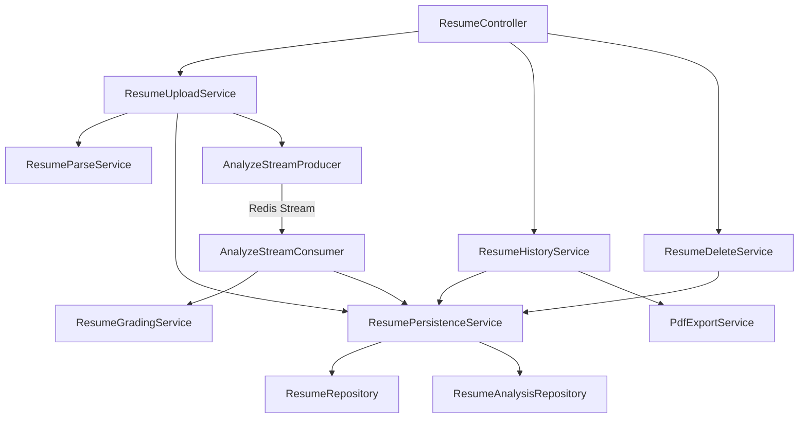
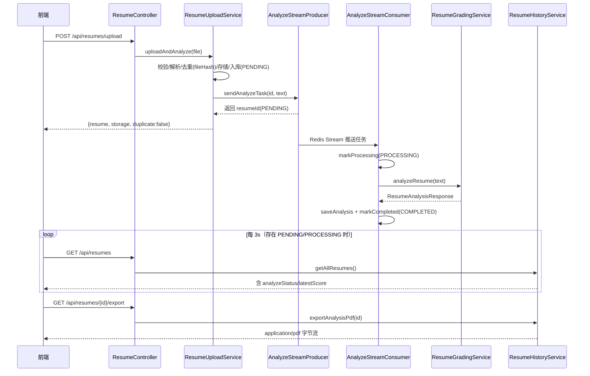

# 模块：resume（Dossier）

> 路径：`app/src/main/java/interview/guide/modules/resume`
> 规模：约 1781 行 · 16 个文件 · 主要语言：Java

## 1. 定位
简历模块（Dossier）负责多格式简历（PDF/DOCX/DOC/TXT/MD）的解析、基于内容哈希的重复检测、基于 Redis Stream 的异步 AI 分析与实时进度跟踪、失败自动重试，以及分析报告 PDF 导出。上传接口为异步模式：上传后立即返回 `PENDING` 状态，分析在后台由消费者线程完成，前端轮询状态直至 `COMPLETED` 或 `FAILED`。

## 2. 关键文件清单
| 文件路径 | 一句话作用 |
|---|---|
| `ResumeController.java` | 暴露 HTTP 接口：上传、列表、详情、导出、删除、重分析、健康检查 |
| `service/ResumeUploadService.java` | 上传入口：校验、解析、去重、存储、入库并投递分析任务 |
| `service/ResumeParseService.java` | 委托通用 `DocumentParseService` 解析文本与检测 MIME 类型 |
| `service/ResumeGradingService.java` | 调用 LLM 并对简历评分（`ResumeAnalysisResponse`） |
| `service/ResumeHistoryService.java` | 列表/详情查询与 PDF 报告导出 |
| `service/ResumeDeleteService.java` | 删除简历（存储文件、面试会话、数据库记录） |
| `service/ResumePersistenceService.java` | 实体持久化、哈希去重、分析结果 JSON 序列化 |
| `repository/ResumeRepository.java` | `resumes` 表 JPA 操作，按 `fileHash` 去重查询 |
| `repository/ResumeAnalysisRepository.java` | `resume_analyses` 表，按简历与时间排序查询 |
| `listener/AnalyzeStreamProducer.java` | 将分析任务投递到 Redis Stream |
| `listener/AnalyzeStreamConsumer.java` | 消费任务、调评分、更新状态、失败重试 |
| `model/ResumeEntity.java` | 简历实体（含 `fileHash`、`analyzeStatus` 字段） |
| `model/ResumeAnalysisEntity.java` | 分析结果实体（5 维评分 + strengths/suggestions JSON） |

## 3. 核心类 / 函数 / 接口
### 3.1 类
| 类名 | 职责 | 关键方法 |
|---|---|---|
| `ResumeUploadService` | 上传业务编排 | `uploadAndAnalyze(MultipartFile)`、`reanalyze(Long)` |
| `ResumeParseService` | 文本解析与类型检测 | `parseResume`、`detectContentType`、`downloadAndParseContent` |
| `ResumeGradingService` | LLM 评分 | `analyzeResume(String) → ResumeAnalysisResponse` |
| `ResumeHistoryService` | 列表/详情/导出 | `getAllResumes()`、`getResumeDetail(Long)`、`exportAnalysisPdf(Long)` |
| `ResumeDeleteService` | 级联删除 | `deleteResume(Long)` |
| `ResumePersistenceService` | 持久化与去重 | `findExistingResume`、`saveResume`、`saveAnalysis`、`getLatestAnalysisAsDTO`、`deleteResume` |
| `ResumeAnalysisProperties` | Prompt 路径配置 | `systemPromptPath`、`userPromptPath`（`app.resume.analysis.*`） |
| `AnalyzeStreamProducer` | 任务生产者 | `sendAnalyzeTask(Long, String)` |
| `AnalyzeStreamConsumer` | 任务消费者 | 覆写 `processBusiness`、`markProcessing/Completed/Failed`、`retryMessage` |

### 3.2 函数（无类）
无独立顶层函数；逻辑均封装于上述 Service / Listener 类内。

### 3.3 HTTP 接口
| 方法 | 路径 | 作用 |
|---|---|---|
| POST | `/api/resumes/upload` | 上传并异步分析（含 GLOBAL/IP 限流各 5 次） |
| GET | `/api/resumes` | 获取全部简历列表 |
| GET | `/api/resumes/{id}/detail` | 获取简历详情（含分析历史与面试历史） |
| GET | `/api/resumes/{id}/export` | 导出分析报告 PDF（`application/pdf`） |
| DELETE | `/api/resumes/{id}` | 删除简历 |
| POST | `/api/resumes/{id}/reanalyze` | 手动重新分析（限流各 2 次） |
| GET | `/api/resumes/health` | 健康检查 |

## 4. 内部架构图（按需）


## 5. 依赖关系
### 5.1 被谁依赖（调用方）
- `ResumeController` 调用 `ResumeUploadService` / `ResumeDeleteService` / `ResumeHistoryService`。
- 前端通过 HTTP 调用：`frontend/src/api/resume.ts`（`uploadAndAnalyze`、`healthCheck`）、`UploadPage.tsx`、`HistoryPage.tsx`。
- `modules/interview` 复用本模块的分析结果与实体（如 `ResumeAnalysisResponse`）。

### 5.2 依赖谁（被调用方）
- `infrastructure/file`：`DocumentParseService`、`ContentTypeDetectionService`、`FileStorageService`、`FileValidationService`、`FileHashService`。
- `infrastructure/export`：`PdfExportService`（导出 PDF）。
- `infrastructure/mapper`：`ResumeMapper`、`InterviewMapper`（MapStruct）。
- `common/ai`：`LlmProviderRegistry`、`StructuredOutputInvoker`。
- `common/async`：`AbstractStreamProducer`、`AbstractStreamConsumer`；`common/constant`：`AsyncTaskStreamConstants`；`common/transaction`：`TransactionalExecutor`；`common/model`：`AsyncTaskStatus`；`common/config`：`AppConfigProperties`；`common/exception`：`BusinessException`、`ErrorCode`。
- `modules/interview`：`ResumeAnalysisResponse`、`ScoreDetail`、`Suggestion`、`InterviewPersistenceService`、`InterviewHistoryItemDTO`。

## 6. 数据流


## 7. 关键设计决策
- **异步分析 + 状态机 → 理由**：LLM 调用耗时且易失败，采用 Redis Stream 解耦上传与评分，实体以 `AsyncTaskStatus`（PENDING/PROCESSING/COMPLETED/FAILED）记录进度，前端轮询即可获得实时状态；消费者统一处理重试（最多 3 次，由 `retryMessage` 重新入队）。**替代方案**：同步调用会阻塞上传响应；线程池无法跨进程且难追踪；Kafka 等消息队列更重，Redis Stream 已满足需求。
- **基于内容哈希去重 → 理由**：`FileHashService` 计算 SHA-256，数据库以 `fileHash` 唯一索引；重复文件直接返回历史分析结果（`handleDuplicateResume`），避免重复消耗 LLM 配额。**替代方案**：按文件名或字节长度判断易冲突；仅在前端提示确认则仍会重复分析。

## 8. 测试覆盖 + 入门调用例子
### 8.1 测试覆盖
本模块无专属单元测试或集成测试类。仓库仅提供共享夹具 `app/src/test/resources/test-files/sample-resume.md` 与 `sample-resume.txt`；`app/src/test/java/.../interview/service/InterviewPersistenceServiceTest.java` 间接引用了 `modules.resume` 的分析实体。

### 8.2 入门调用例子
上传并触发异步分析：
```bash
curl -F "file=@resume.pdf" http://localhost:8080/api/resumes/upload
# 返回 {"resume":{"id":1,"analyzeStatus":"PENDING"},"storage":{"fileKey":"...","resumeId":1},"duplicate":false}
```
后端直接调用：
```java
Map<String,Object> r = resumeUploadService.uploadAndAnalyze(file);     // 投递 + 返回 PENDING
ResumeDetailDTO d = resumeHistoryService.getResumeDetail(1L);          // 轮询/查看结果
byte[] pdf = resumeHistoryService.exportAnalysisPdf(1L).pdfBytes();    // 导出报告
```

> **回到** [ARCHITECTURE.md](../ARCHITECTURE.md)
