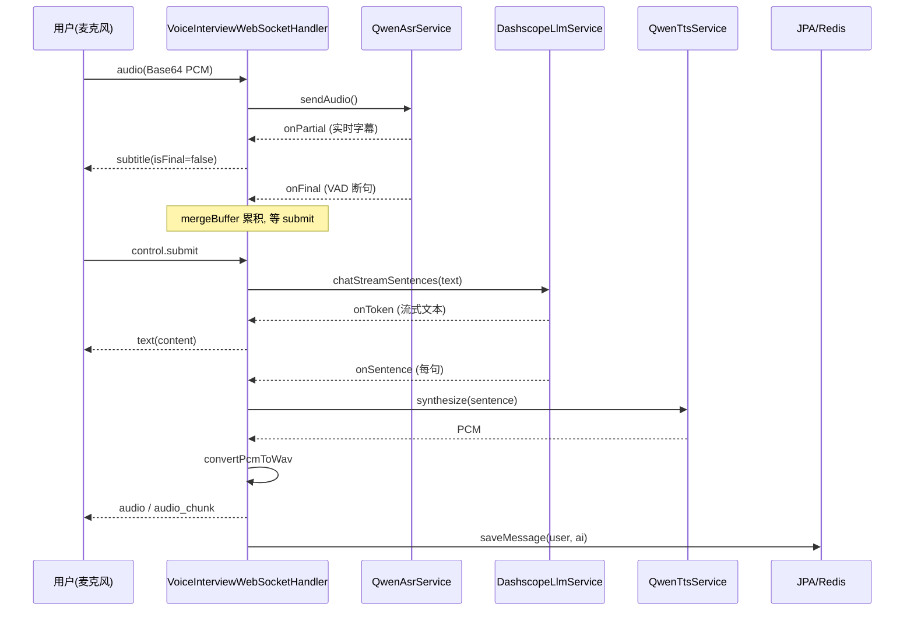

# 模块：voiceinterview（Dossier）

> 路径：`app/src/main/java/interview/guide/modules/voiceinterview`
> 规模：约 5448 行 · 28 个文件 · 主要语言：Java

## 1. 定位
基于 WebSocket 的实时语音面试模块：客户端上行 PCM 音频，经阿里云百炼 DashScope 千问3 语音模型（`qwen3-asr-flash-realtime` / `qwen3-tts-flash-realtime`）做 ASR → Spring AI 2.0 `ChatClient` 做 LLM → TTS，再以音频（WAV）+ 字幕下行。核心能力：服务端 VAD 自动断句、实时字幕（含中间结果 partial）、句子级并发 TTS、回声防护 + 手动 submit、多轮上下文压缩、暂停/恢复（超时自动暂停）、Micrometer 埋点。`VoiceInterviewWebSocketHandler`（1484 行）是编排中枢，`VoiceInterviewService`（753 行）负责会话生命周期与持久化。评估复用 `common/evaluation/UnifiedEvaluationService`（文字与语音共用引擎）。

## 2. 关键文件清单
| 文件路径 | 一句话作用 |
| --- | --- |
| `handler/VoiceInterviewWebSocketHandler.java` | WebSocket 编排中枢：连接/音频/控制消息处理、STT→LLM→TTS 管线、回声防护、暂停超时、埋点 |
| `service/VoiceInterviewService.java` | 会话生命周期（创建/结束/暂停/恢复/删除）、消息与摘要持久化、Redis 缓存、评估任务投递 |
| `service/QwenAsrService.java` | DashScope 千问3 Realtime ASR 封装：多会话并发、服务端 VAD、断线重连、partial/final 回调 |
| `service/QwenTtsService.java` | DashScope qwen-tts-realtime 封装：`commit` 模式同步合成、30s 超时、PCM 收集 |
| `service/DashscopeLlmService.java` | LLM 调用：流式句子级回调、文本推送节流、语音优化（截断到句边界）、错误映射 |
| `service/VoiceInterviewEvaluationService.java` | 异步评估：构建 QaRecord、委托 UnifiedEvaluationService、结果落库与 DTO 组装 |
| `context/VoiceContextCompressor.java` | 多轮上下文压缩：滑动窗口 + 增量摘要（NONE/WINDOW/SUMMARY），降低 prompt token |
| `listener/VoiceEvaluateStreamProducer.java` / `Consumer.java` | 评估任务 Redis Stream 生产者/消费者（PENDING→PROCESSING→COMPLETED/FAILED + 重试） |
| `config/VoiceInterviewProperties.java` | `@ConfigurationProperties(prefix="app.voice-interview")`：阶段、ASR/TTS、压缩、开场白等配置 |
| `controller/VoiceInterviewController.java` | REST 接口：会话 CRUD、消息、评估触发与轮询 |

## 3. 核心类 / 函数 / 接口
### 3.1 类
- `VoiceInterviewWebSocketHandler`：内部类 `SessionState`（AccumulatedText、mergeBuffer、aiSpeaking、aiSpeakEndAt 冷却期等 `Atomic*` 字段）；内部类 `OrderedTtsChunkEmitter`（按序分块下发 TTS）。
- `VoiceInterviewService`：`@Transactional` 会话方法；Redis（`RedissonClient`）缓存 key `voice:interview:session:{id}`（TTL 1h）。
- `QwenAsrService`：内部类 `AsrSession`（`CountDownLatch` 表示 ready）；`sessions` / `sessionLocks` 并发 Map。
- `VoiceInterviewSessionEntity.InterviewPhase`：`INTRO/TECH/PROJECT/HR/COMPLETED`；`VoiceInterviewSessionStatus`：`IN_PROGRESS/PAUSED/COMPLETED/FAILED`；评估状态用 `common.model.AsyncTaskStatus`。

### 3.2 函数（无类）
- `VoiceInterviewWebSocketHandler.convertPcmToWav(byte[])`：手写 44 字节 WAV 头（24kHz/16bit/mono），供浏览器播放。
- `VoiceContextCompressor.compress(...)` / `formatRecent(...)`：返回 `record CompressedHistory(summary, recent, coveredTurns, changed)`。
- `DashscopeLlmService.optimizeForVoice(...)`：按 `aiQuestionMaxChars` 截断到句边界。

### 3.3 HTTP 接口 + WebSocket 协议
**HTTP 路由表**（`VoiceInterviewController`，前缀 `/api/voice-interview`）：

| 方法 & 路径 | 作用 |
| --- | --- |
| `POST /sessions` | 创建会话，返回 `SessionResponseDTO`（含 `webSocketUrl`） |
| `GET /sessions/{id}` | 会话详情 |
| `POST /sessions/{id}/end` | 结束会话（并投递评估任务） |
| `PUT /sessions/{id}/pause` | 暂停（`{reason}`，默认 `user_initiated`） |
| `PUT /sessions/{id}/resume` | 恢复，返回新 `webSocketUrl` |
| `GET /sessions` | 列表（`userId`/`status` 过滤） |
| `DELETE /sessions/{id}` | 删除会话及关联消息/评估 |
| `GET /sessions/{id}/messages` | 对话历史 DTO |
| `GET /sessions/{id}/evaluation` | 评估状态与结果（轮询） |
| `POST /sessions/{id}/evaluation` | 触发异步评估（PENDING） |

**WebSocket 端点**：`/ws/voice-interview/{sessionId}`（`WebSocketConfig` 注册，`HttpSessionHandshakeInterceptor` + CORS 放行）。

**上行（Client → Server）**：
| type | 字段 | 处理 |
| --- | --- | --- |
| `audio` | `data`(Base64 PCM) | `handleUserAudio` → `QwenAsrService.sendAudio` |
| `control` | `action=submit`, `data.text?` | 写 mergeBuffer 并 `flushMergedUtteranceToLlm` |
| `control` | `action=end_interview` | `interviewService.endSession` |
| `control` | `action=start_phase`, `phase` | `interviewService.startPhase` |

> 注：`WebSocketControlMessage` 的注释里把 `action` 取值列为 `"start_phase", "end_phase", "end_interview", "submit"`，但 `VoiceInterviewWebSocketHandler` 的 `switch` 实际只实现了 `submit` / `end_interview` / `start_phase` 三个分支——`end_phase` 目前没有对应处理。上表以 handler 的实际分支为准。

**下行（Server → Client）**：
| type | 字段 | 含义 |
| --- | --- | --- |
| `control` | `action=welcome` | 连接成功 |
| `control` | `action=asr_ready` / `asr_reconnecting` | ASR 就绪 / 自动重连中 |
| `subtitle` | `text`, `isFinal` | 实时字幕（partial 或定稿） |
| `text` | `content`, `final` | 流式/最终 AI 文本 |
| `audio` | `data`(Base64 WAV), `text` | 合并模式整段音频 |
| `audio_chunk` | `data`, `index`, `isLast` | 分块模式逐句音频（`chunkedAudioEnabled`） |
| `control` | `action=audio_complete` | 分块音频播放完成 |
| `control` | `action=pause_timeout_warning` / `pause_timeout` | 4:30 警告 / 5:00 超时暂停 |
| `error` | `message` | 错误提示 |

## 4. 内部架构图（按需）
```mermaid
flowchart LR
  FE[前端 voiceInterview.ts] -->|WS /ws/voice-interview/{id}| H[VoiceInterviewWebSocketHandler]
  FE -->|HTTP /api/voice-interview/*| C[VoiceInterviewController]
  C --> S[VoiceInterviewService]
  H --> ASR[QwenAsrService] -->|wss DashScope| D1[(qwen3-asr)]
  H --> LLM[DashscopeLlmService] --> REG[LlmProviderRegistry]
  H --> TTS[QwenTtsService] -->|wss DashScope| D2[(qwen3-tts)]
  S --> REP[(JPA + Redis)]
  S --> PROD[VoiceEvaluateStreamProducer] -->|Redis Stream| CONS[VoiceEvaluateStreamConsumer] --> EVAL[VoiceInterviewEvaluationService] --> UNI[UnifiedEvaluationService]
```

## 5. 依赖关系
### 5.1 被谁依赖（调用方）
- 前端 `frontend/src/api/voiceInterview.ts`：HTTP `voiceInterviewApi` + `VoiceInterviewWebSocket` 客户端。
- `WebSocketConfig` 装配 `VoiceInterviewWebSocketHandler`；评估由本模块的 `Producer`/`Consumer` 自驱动消费。

### 5.2 依赖谁（被调用方）
- `common/ai`：`LlmProviderRegistry`（voice/chat client）、`PromptSanitizer`、`PromptSecurityConstants.ANTI_INJECTION_INSTRUCTION`。
- `common/evaluation`：`UnifiedEvaluationService`、`EvaluationReport`、`QaRecord`（评估引擎复用）。
- `common/async`（`AbstractStreamProducer/Consumer`）、`common/transaction`（`TransactionalExecutor`）、`infrastructure/redis`（`RedisService`）、`RedissonClient`。
- `modules/resume`（`ResumeRepository`/`ResumeEntity`）、`modules/interview/skill`（`InterviewSkillService`）。
- `common/constant`（`AsyncTaskStreamConstants`、`CommonConstants.InterviewDefaults`）、`common/model`（`AsyncTaskStatus`）、`common/exception`、`common/result`、`common/config`（`CorsProperties`）、Spring Data JPA。

## 6. 数据流


## 7. 关键设计决策
**决策：服务端 VAD + 手动 submit 才触发 LLM，而非每句自动发问。**
→ 理由：服务端 VAD 自动断句会产生多段 final 片段，立即逐段发 LLM 会让候选人来不及说完；累积到 mergeBuffer、由前端 `submit` 统一提交，贴合口语对话节奏并避免抢话。
→ 替代方案：每收到 final 即触发 LLM（已弃用，导致话未说完就追问）。

**决策：句子级并发 TTS + 分块音频下发（`OrderedTtsChunkEmitter`）。**
→ 理由：LLM 流式输出期间每检测句边界即并发启动 TTS（`Semaphore` 限 `maxConcurrentTtsPerSession`），按序下发 `audio_chunk`，首句音频延迟显著降低。
→ 替代方案：等整段 LLM 完成再一次性 TTS（首字到首音延迟高）；或纯整段合并（无分块进度）。

## 8. 测试覆盖 + 入门调用例子
### 8.1 测试覆盖
测试位于 `app/src/test/java/interview/guide/modules/voiceinterview/`，覆盖：Handler（`VoiceInterviewWebSocketHandlerTest`）、上下文压缩（`VoiceContextCompressorTest`）、控制器评估（`VoiceInterviewControllerEvaluationTest`）、状态枚举、Prompt（`VoiceInterviewPromptServiceTest`）、ASR/TTS（`QwenAsrServiceTest`/`QwenTtsServiceTest`）、评估（`VoiceInterviewEvaluationServiceTest`/`RecoveryTest`）、Service（`VoiceInterviewServiceTest`/`PauseTest`/`SummaryPersistenceTest`）、LLM（`DashscopeLlmServiceTest`）、集成（`integration/VoiceInterviewIntegrationTest`）。

### 8.2 入门调用例子
```typescript
// 1) 创建会话（后端返回 webSocketUrl）
const { sessionId, webSocketUrl } = await voiceInterviewApi.createSession({ skillId: 'java-backend' });
// 2) 建立 WebSocket
const ws = connectWebSocket(sessionId, webSocketUrl, {
  onAudioResponse: (data, text) => playWav(data),     // 播放 AI 音频
  onSubtitle: (text, isFinal) => renderSubtitle(text),// 实时字幕
});
// 3) 麦克风 PCM 每 2s 上行
ws.sendAudio(base64Pcm);
// 4) 候选人说完后手动提交（或带文本）
ws.sendControl('submit');
// 5) 结束并轮询评估
await voiceInterviewApi.endSession(sessionId);
const r = await voiceInterviewApi.getEvaluation(sessionId); // 直到 evaluateStatus=COMPLETED
```

> **回到** [ARCHITECTURE.md](../ARCHITECTURE.md)
